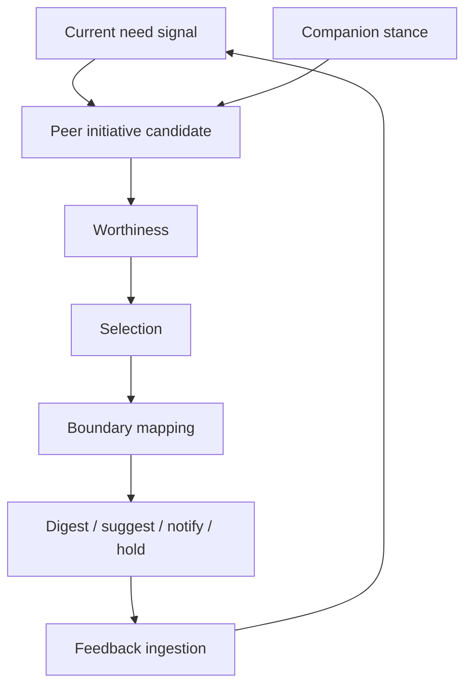

# Peer Initiative

> Status: Active design contract for bounded self-initiated companion messages.
> This page describes the current implementation shape and product boundaries.

Primary map: [Initiative Core](./initiative-core-map.md).

Peer initiative is PulSeed's ability to speak first for a legitimate reason.
It is not a generic reminder bot, a random personality system, or an engagement
optimization loop.

## Implementation Anchors

- `src/runtime/peer-initiative/`
- `src/runtime/gateway/outbound-conversation.ts`
- `src/runtime/store/feedback-ingestion-store.ts`
- `src/runtime/store/proactive-intervention-store.ts`
- `src/runtime/daemon/runner-resident-proactive.ts`
- `src/runtime/gateway/telegram-gateway-adapter.ts`

## Candidate Grounding

Peer initiatives require grounding. Current grounding types include:

- attention state
- relationship context
- open conversation thread
- ambient care
- capability fit
- shared ritual

This is the core rule: PulSeed can speak first only when it can point to why the
message belongs now.

## Current Need Signals

Current need signals include:

- care presence is appropriate
- decision load is high
- the day is overpacked
- a thread is stalled
- a conversation is unfinished but salient
- a capability would reduce current burden
- gentle pushback is appropriate

The signal is not itself delivery permission. It feeds candidate generation and
worthiness evaluation.

## Worthiness

A proactive message must be worth interrupting the user's attention.

Worthiness checks:

- can be valuable without a reply
- user cognitive load
- reply pressure
- care value
- attention fit
- concrete helpfulness
- self-serving risk
- tutorial risk

If reply pressure is strong or self-serving risk is high, the message should be
held or reframed.

## Message Contract

Peer messages should be:

- short
- reply-optional
- grounded
- low pressure unless the user explicitly asked for stronger prompting
- specific to the user's current context
- clear when an external action requires confirmation

They should not:

- pretend to have human feelings
- create artificial urgency
- push product education
- ask for engagement for its own sake
- bypass approval or runtime control

## Capability Disclosure

PulSeed can mention a capability when the current need makes that capability
useful.

Good:

> I can turn this thread into a short plan if that would reduce the decision load.

Bad:

> Did you know PulSeed has a planning feature? Try it now.

The difference is that the first message is grounded in current need. The second
is tutorial copy.

## Boundary Mapping

Boundary mapping ties peer initiative back into runtime authority:

| Peer action | Runtime boundary |
| --- | --- |
| care-only message | surface delivery policy |
| prepared summary or draft | internal preparation |
| reminder candidate | schedule suggestion or permission request |
| external message | explicit confirmation |
| capability suggestion | capability/admission projection |
| held candidate | threshold or inhibition record |

This keeps proactivity from becoming a side channel around control policies.

## Feedback

Feedback ingestion should record whether a proactive intervention was accepted,
ignored, suppressed, too frequent, useful, not useful, or overreaching.

Feedback affects:

- future thresholding
- stance
- delivery frequency
- capability disclosure
- relationship memory correction
- notification routing

## Production Rule

Any peer-initiative change must be tested through a production caller path when
possible: resident proactive tick, gateway delivery, outbound conversation, or
feedback ingestion. Testing only a low-level candidate builder is not enough for
behavioral confidence.
