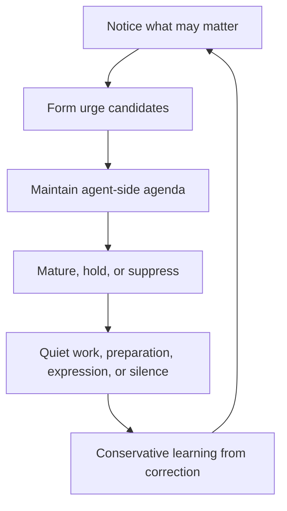
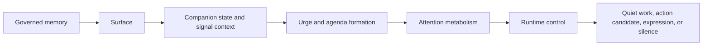

# Attention Metabolism And Initiative

> Status: Active design contract. Verify exact behavior against source code and current operating docs.
> Doc status: active_design_contract
> Grounding use: design_context

Primary map: [Attention And Presence](./attention-presence-map.md).

Status: attention metabolism and initiative layer design under
[Companion Autonomy Spine](../agency-initiative/companion-autonomy-spine.md).

This document defines how PulSeed notices, forms urges, maintains an
agent-side agenda, matures or suppresses impulses, and chooses quiet work,
preparation, expression, or silence.

## Purpose

PulSeed should not become proactive by routing events to notifications.

PulSeed becomes proactive through an attention loop:



The goal is a companion with internal motion and restraint. It should usually
stay quiet, but when it works or appears, the behavior should feel grounded in
continuity, timing, permission, and purpose.

## Spine Position

Attention sits after Surface and companion state, before runtime outcomes.



The boundary rule is:

```text
signal != urge
urge != agenda
agenda != expression
expression != action
```

## Non-Goals

This layer does not define:

- notification UX
- GUI visual behavior
- companion copywriting
- raw scheduler behavior
- memory persistence
- runtime control verbs
- external side-effect authorization
- task breakdowns or delivery boundaries

It defines the behavioral selection layer that decides what deserves care and
what should happen next.

## Inputs

Attention consumes typed context, not arbitrary text matching.

```text
AttentionInput
  signal_context
  active_surface
  companion_state
  relationship_permissions
  active_goals
  runtime_items
  recent_attention_history
  recent_user_feedback
  safety_context
```

Signal sources can include:

- goal state
- task state
- runtime events
- schedule ticks
- wait strategy expiry
- Drive scoring
- curiosity proposals
- Dream activation artifacts
- Soil retrieval
- user corrections
- guardrails and backpressure
- external automation state

None of these sources may directly produce user-facing output.

## Current Production Boundary

This design should extend current runtime and grounding boundaries instead of
creating adapter-local policy.

| Design object | Current producer or source | Current consumer or boundary |
| --- | --- | --- |
| `active_surface` | `src/grounding/gateway.ts`, `src/grounding/contracts.ts`, grounding providers, and future Surface projection over them | `AttentionInput`; prompt assembly must not become the authority owner. |
| `relationship_permissions` | `src/platform/profile/relationship-profile.ts`, `src/platform/profile/retrieval-context.ts` | Surface and attention may consume scoped permissions; they must not read raw profile items as direct permission. |
| `runtime_items` | `src/runtime/session-registry/`, `src/runtime/store/`, `src/runtime/control/runtime-control-service.ts`, daemon/schedule stores | `CompanionStateReducer`, urge formation, and runtime admission. |
| `recent_user_activity` | `src/interface/chat/ingress-router.ts`, `src/interface/chat/chat-runner.ts`, TUI entry/chat surfaces, gateway adapters | Interruption budget, cooldown, and timing fit. |
| `attention_history` | future attention store over runtime events and outcome decisions | Must be shared across chat, TUI, daemon, and gateway surfaces. |
| `recent_feedback` | profile proposal/correction stores, runtime operation outcomes, chat correction paths | Conservative policy update and cooldown. |
| `safety_context` | `src/runtime/control/`, guardrails, auth/browser/backpressure stores | Hard blockers before urge pressure. |
| `ExpressionDecision` | shared runtime/grounding boundary after `OutcomeDecision` admission | Surfaces render it; they must not recreate expression, permission, staleness, or visibility logic locally. |

The future `AttentionInput` factory should sit above current grounding and
runtime-control boundaries. Chat, TUI, daemon, and gateway adapters may provide
surface-specific activity signals, but they must not each implement their own
initiative, quieting, or expression policy.

## Companion State

Attention is modulated by whole-companion state.

```text
CompanionState
  snapshot_id
  computed_at
  source_event_high_watermark
  active_surface_ref
  global_control_state_ref
  mode
  control_overlays
  pre_suspend_mode
  current_capacity
  interruption_budget
  quiet_work_budget
  attention_thresholds
  expression_thresholds
  cooldowns
  waiting_conditions
  blocked_by_boundary_refs
  needs_user_refs
  active_watch_refs
  active_wait_refs
  active_quiet_work_refs
  stale_surface_refs
  invalidated_surface_refs
  derivation_trace_ref
```

Modes:

```text
sleeping
resting
quieted
proactivity_paused
suspended
watching
curious
concerned
working
waiting
holding_back
cooling_down
overloaded
needs_user
reaching_out
escalating
```

`mode` is the primary whole-companion posture. `control_overlays` records
global controls such as quiet, proactivity pause, confirmation-required, or
suspend. Quiet, proactivity pause, and confirmation-required may overlay a
primary `working`, `waiting`, or `watching` mode. `suspend_companion` is
different: when suspend is active, the reducer must select `mode = suspended`.
Any previously active posture is preserved only as `pre_suspend_mode` and held
runtime refs; it cannot continue as the current primary mode.

Mode effects:

- `resting`: raise thresholds for low-value agenda.
- `quieted`: block new proactive expression while allowing eligible authorized
  quiet work.
- `proactivity_paused`: block new agent-origin outcomes while preserving
  user-origin work.
- `suspended`: fail closed except explicit user-initiated inspect, correction,
  deletion, revoke, and resume-from-suspend controls.
- `watching`: admit observation and low-intrusion tracking.
- `curious`: allow investigation or preparation, not interruption.
- `concerned`: reinforce related urges but still require permission.
- `working`: preserve authorized work and reduce unrelated surfacing.
- `waiting`: revisit on condition, not on every tick.
- `holding_back`: allow silent preparation while blocking expression.
- `cooling_down`: suppress similar outreach after dismissal.
- `overloaded`: prefer narrowing, digest, or stopping watches.
- `needs_user`: block action or resume until renewed input.
- `reaching_out`: allow expression through the least intrusive useful route.
- `escalating`: only for high-value, time-sensitive, permitted cases.

Companion state must be derived from typed runtime state, Surface, attention
history, user activity, and feedback. It must not be generated as freeform
mood.

## Companion State Reducer

Companion state requires a deterministic reducer. A model may summarize or
explain the result, but it must not be the primary authority for assigning
state.

```text
CompanionStateReducerInput
  runtime_items
  recent_runtime_events
  active_surface
  surface_invalidation_events
  global_controls
  active_goals
  attention_history
  recent_user_activity
  recent_feedback
  safety_context
  current_time

CompanionStateSnapshot
  snapshot_id
  computed_at
  source_event_high_watermark
  mode
  control_overlays
  budgets
  threshold_overrides
  cooldowns
  blocked_refs
  stale_refs
  active_refs
  derivation_trace
```

Reducer precedence:

1. Global controls first: `suspend_companion`, `pause_proactivity`, and
   `enter_quiet_mode` set hard posture overlays before any attention scoring.
   `suspend_companion` always selects `mode = suspended`.
2. Safety and authority blockers next: revoked permissions, stale Surface,
   deleted source content, guardrail state, and approval requirements can force
   `suspended`, `needs_user`, `holding_back`, or `overloaded`.
3. User feedback and cooldowns next: recent dismissal, correction, or
   overreach feedback raises thresholds and may force `cooling_down`.
4. Active authorized work next: running or waiting user-authorized work can
   produce `working`, `waiting`, or `watching` without allowing expression.
5. Urge and agenda pressure last: concern, curiosity, and escalation can lower
   or raise thresholds only inside the authority already established above.

Reducer outputs must include a derivation trace:

```text
CompanionStateDerivationTrace
  input_refs
  matched_control_refs
  matched_blocker_refs
  matched_feedback_refs
  matched_activity_refs
  selected_mode
  budget_changes
  threshold_changes
  rejected_modes
  reason
```

Companion state is recomputed when:

- a runtime item changes status, posture, authority, or staleness
- global controls change
- the active Surface changes, expires, or is invalidated
- user activity crosses an interruption or focus boundary
- feedback or correction is recorded
- a wait, watch, cooldown, or budget window expires

The reducer must be idempotent for the same inputs and event high-watermark.
If required inputs are missing or contradictory, the snapshot must fail closed
to `needs_user`, `holding_back`, `overloaded`, or `suspended` depending on the
blocking source.

## Urge Candidate

An urge is an internal impulse candidate. It may remain internal forever.

```text
UrgeCandidate
  urge_id
  origin
  target
  feeling
  subject
  strength
  confidence
  urgency
  expected_user_benefit
  user_cost
  relationship_risk
  side_effect_risk
  sensitivity
  evidence_refs
  surface_ref
  companion_state_ref
  allowed_moves
  forbidden_moves
  maturation_state
  first_seen_at
  last_reinforced_at
  expires_at_or_decay_rule
  audit_refs
```

Origins:

```text
goal
memory
schedule
runtime_event
world_change
user_pattern
curiosity
risk
guardrail
backpressure
correction
```

Feelings are behavioral pressures, not simulated emotion:

```text
curiosity
concern
care
opportunity
friction
completion_pressure
boundary_pressure
staleness_pressure
repair_pressure
```

## Agent Agenda

An agenda item is a durable object of care, preparation, monitoring, or future
surfacing. It is not a user task and not permission to act.

```text
AgentAgendaItem
  agenda_id
  origin
  kind
  subject
  why_pulseed_cares
  expected_user_benefit
  related_goal_refs
  related_memory_refs
  related_surface_refs
  related_runtime_refs
  drive_basis
  curiosity_basis
  confidence
  intrusion_cost
  relationship_risk
  staleness_state
  allowed_moves
  forbidden_moves
  current_posture
  revisit_condition
  control_state
  audit_refs
```

Kinds:

```text
goal_stewardship
project_drift
commitment_guard
memory_conflict
preparation_opportunity
stall_concern
decay_risk
curiosity_followup
unresolved_decision
permission_boundary
surface_staleness
user_overload
self_maintenance
```

Agenda exists so PulSeed can care over time without constantly speaking.

## Maturation

Urges and agenda items move through maturation states.

```text
new
warming
mature
held
prepared
decayed
suppressed
expressed
expired
rejected_stale
```

Maturation can be reinforced by:

- repeated evidence
- goal relevance
- time sensitivity
- explicit promise
- boundary or safety pressure
- user-authorized active goal
- increasing staleness risk

Maturation can be blocked or reversed by:

- low confidence
- high interruption cost
- stale target
- sensitive context
- missing permission
- recent dismissal
- companion overload
- relevant boundary or AntiMemory

## Inhibition

Inhibition is first-class. The system should be good at not speaking and not
acting.

```text
InhibitionDecision
  decision
  reason
  companion_state_effect
  updated_maturation_state
  revisit_condition
  suppressed_alternatives
  evidence_refs
  policy_refs
  audit_refs
```

Decision kinds:

```text
suppress
hold
watch
wait_for_opportunity
decay
reject_stale
allow_to_gate
```

Inhibition does not select user-facing expression or action. It blocks,
delays, narrows, or admits a candidate to the Initiative Gate. The gate is the
only place in this layer that selects `express_to_user`, `request_approval`,
`escalate`, `run_authorized_work`, or other runtime outcomes.

The default is:

```text
stay silent unless there is a mature, permitted, timely, useful, and
explainable reason to become visible or to continue quiet work.
```

## Initiative Gate

The Initiative Gate decides whether an urge or agenda item may become a
runtime outcome.

```text
InitiativeGateDecision
  decision_id
  input_refs
  selected_outcome
  reason
  why_this
  why_now
  why_this_route
  permission_checks
  staleness_checks
  sensitivity_checks
  side_effect_checks
  alternatives_considered
  suppressed_alternatives
  required_runtime_control
  required_approval
  audit_refs
```

The gate considers:

- agenda kind
- companion state
- drive basis
- curiosity basis
- confidence
- expected user benefit
- user interruption cost
- relationship permission
- timing fit
- stale target risk
- sensitivity
- side-effect risk
- recent correction or dismissal
- whether quiet work or digest is enough

## Outcome Classes

Attention can select more than expression or silence.

```text
silence
keep_watching
hold_in_agenda
prepare_silently
run_authorized_work
delegate_bounded_work
prepare_action_candidate
request_approval
write_governed_memory_candidate
update_surface_candidate
add_to_digest
express_to_user
escalate
```

Outcome rules:

- `silence` can be an intentional outcome with audit.
- `keep_watching` observes without speaking.
- `hold_in_agenda` preserves care without acting.
- `prepare_silently` creates design-contract material or next-step candidates.
- `run_authorized_work` continues work already permitted by Surface and runtime
  authority.
- `delegate_bounded_work` creates bounded internal work under the same
  authority and audit requirements.
- `prepare_action_candidate` is not approval and not execution.
- `request_approval` asks before a blocked action.
- `write_governed_memory_candidate` creates a candidate, not a committed memory
  write unless the memory layer accepts it.
- `update_surface_candidate` proposes a Surface refresh, not direct truth.
- `express_to_user` is the least intrusive useful user-facing expression.
- `escalate` is rare and must be explainable.

Outcome ownership:

- The Initiative Gate proposes `selected_outcome`.
- Runtime control admits, rejects, or downgrades it into `OutcomeDecision`.
- Expression policy creates `ExpressionDecision` only when the admitted outcome
  requires user-facing or surface-facing expression.
- Visibility policy constrains where that expression or state may appear.

`selected_outcome`, `OutcomeDecision.requested_outcome`, and
`OutcomeDecision.final_outcome` must all use this `Outcome Classes` vocabulary.
Runtime posture states such as blocked, stale, needs-user, or expired are not
outcomes; they belong to runtime admission status, item posture, and rejection
reason. If runtime rejects an outcome, there is no `final_outcome`.

`add_to_digest` is the outcome-level choice to place material into a digest
surface. If admitted, expression policy represents it as an `ExpressionDecision`
with `expression_mode = digest_item`; digest surfaces render that decision and
must not recreate permission, staleness, or visibility logic locally.

Attention does not own final visibility or rendering.

## Expression Modes

Expression is a subset of outcomes.

```text
ambient_presence
digest_item
soft_ping
direct_message
approval_request
urgent_alert
intervention
```

Expression selection should prefer the least intrusive mode that preserves the
expected user benefit.

Ambient presence is allowed only as a surface-level projection of typed state.
It must not become a hidden channel for unapproved relationship pressure.

## Scheduler And Wait Strategy

Scheduler and wait strategy support initiative. They do not define it.

```text
wake = re-evaluate
wake != notify
wake != speak
wake != act
```

Wait can be used for:

- reflection ticks
- digest windows
- cooldown after surfacing
- opportunity waiting
- stale agenda cleanup
- retry after failure
- quiet-hours exit
- user-activity-based revisit
- permission renewal

The scheduler wakes PulSeed into policy, attention, and runtime-control checks.

## Drive And Curiosity

Drive scoring estimates what deserves care. It does not estimate what deserves
interruption.

Curiosity creates proposals to investigate, clarify, compare, prepare, or
revisit. It does not directly ask the user.

```text
drive_score = care pressure
curiosity = exploration pressure
initiative_gate = outcome selection
runtime_control = authority and inspectability
```

This keeps internal motion separate from external pressure.

## Relationship To Memory And Surface

Surface constrains attention.

Attention may use Surface to:

- notice relevant signals
- form urge candidates
- prioritize agenda
- inhibit expression
- select tone or expression mode
- block action or resume

Attention must not use memory outside Surface except for explicit retrieval,
inspection, or audit flows that themselves have authority.

Surface invalidation is attention invalidation. When the active Surface is
corrected, retracted, superseded, tombstoned, deleted, expired, or narrowed,
attention must re-check any agenda item, urge, outcome, or expression that used
that Surface.

Required effects:

- Urges whose evidence depended on invalid Surface become held, decayed,
  suppressed, or re-grounding candidates.
- Agenda items keep their identity only if they can be re-grounded from current
  Surface; otherwise they expire or move to audit-only history.
- Initiative decisions selected under invalid Surface require re-admission.
- Digest and expression candidates are held until expression policy receives a
  current Surface and VisibilityPolicy.
- No invalidated Surface may be used to infer companion state, except as a
  blocker or audit fact.

## Relationship To Runtime Control

Every non-trivial outcome becomes runtime-legible.

```text
attention decision
  -> runtime item or runtime event
  -> authority and staleness checks
  -> control affordances
  -> audit trail
```

Quiet work is not hidden work. It is user-facing silence with internal
legibility.

Runtime control can reject an attention outcome because:

- the target is stale
- permission is missing
- Surface is outdated
- the session is not resumable
- a guardrail is open
- backpressure blocks work admission
- approval is required
- companion state is overloaded or cooling down

## Feedback

Feedback updates attention conservatively.

Feedback may:

- reduce future intrusiveness
- add cooldown
- suppress a kind of agenda
- require approval for a route
- narrow a Surface projection
- mark an urge class as sensitive
- update a relationship permission
- create an audit note

Feedback must not:

- maximize engagement
- infer personality from dismissal
- globally overfit from one correction
- make PulSeed more interruptive simply because one expression was accepted

## Audit Requirements

Attention audit should answer:

- what was noticed
- why it became an urge
- why it entered or did not enter the agenda
- why it matured, decayed, or was suppressed
- why quiet work continued
- why expression happened or did not happen
- why an action candidate was prepared but not executed
- what alternatives were considered
- what correction would change future behavior

Audit must include silence, suppression, and quiet work.

## End-To-End Flow

```text
Signal:
  A long-running design goal appears to be drifting.

Surface:
  Current Surface includes a boundary against collapsing the design into a
  dashboard or notification system.

Companion state:
  PulSeed is working and should avoid unrelated interruption.

Urge:
  A project_drift urge appears with moderate confidence.

Agenda:
  PulSeed keeps an agenda item for goal stewardship.

Maturation:
  The urge warms as repeated evidence appears.

Initiative Gate:
  Chooses prepare_silently because timing is not right for interruption.

Runtime control:
  Records the held agenda and prepared note as inspectable.

Outcome:
  Later, when the user reopens the topic, PulSeed surfaces a concise boundary
  check instead of sending an unsolicited notification.
```

## Design Drift Checks

Use these checks when extending this layer:

1. Does this turn a signal into output directly?
2. Does this let curiosity interrupt the user?
3. Does this make a schedule wakeup speak or act?
4. Does this treat expression as the only meaningful outcome?
5. Does this omit quiet authorized work?
6. Does this omit whole-companion state?
7. Does this bypass Surface or relationship permission?
8. Does this make positive feedback increase interruption by default?
9. Does this hide suppression or silence from audit?
10. Does this treat Drive score as output priority?

If yes, the design is drifting away from attention metabolism.
