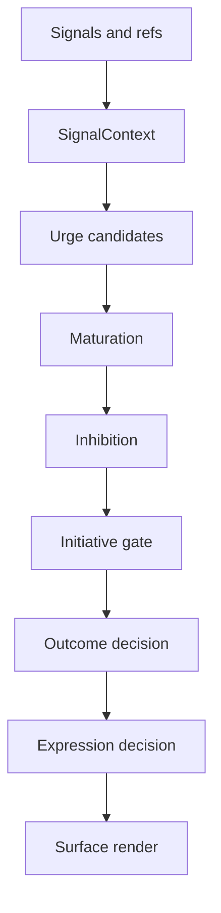
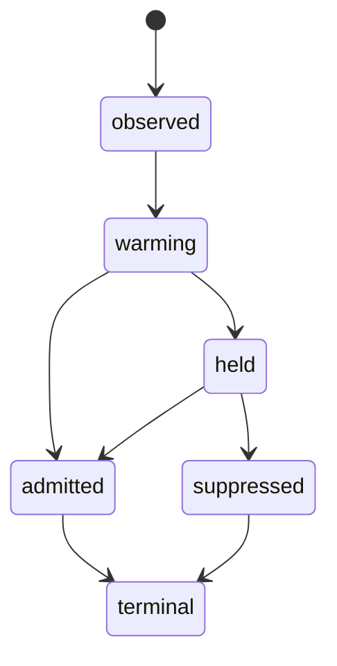

# Attention And Presence

> Status: Active design contract for current attention and companion-presence
> runtime paths. Exact behavior is owned by current schemas, stores, and tests.

Primary map: [Attention And Presence](./attention-presence-map.md).

Attention is how PulSeed decides what matters now.

Presence is how that decision becomes visible, quiet, or actionable across chat,
TUI, daemon, schedules, and gateway channels.

## Implementation Anchors

- `src/runtime/attention/`
- `src/runtime/types/companion-autonomy.ts`
- `src/runtime/types/companion-state.ts`
- `src/runtime/daemon/resident-attention-orchestrator.ts`
- `src/runtime/daemon/runner-resident-proactive.ts`
- `src/interface/chat/seedy-presence-view-model.ts`
- `src/runtime/gateway/seedy-presence-projector.ts`

## Signal Context

Attention begins by assembling typed references, not by scanning freeform text
for keywords.

Signal sources include:

- runtime events
- schedule ticks
- waits
- user activity
- relationship permissions
- active sessions and goals
- approval and runtime-control state
- observations
- feedback
- guardrails and backpressure

Each signal can carry lifecycle and redaction information. Redacted or deleted
content can still leave a safe tombstone or metadata ref for audit without
materializing sensitive content.

## Scope

Attention scope binds a signal to its user, workspace, surface, conversation,
session, permission scope, sensitivity, memory owner, and policy epoch.

This prevents two classes of bugs:

- a signal from one surface being delivered into another surface without
  readmission
- memory or target reuse after the source context became stale

## Urge Candidates

An urge candidate is not an action. It is a structured "maybe PulSeed should
care about this" record.

Important fields:

- origin
- target
- feeling
- subject
- strength and confidence
- urgency
- expected user benefit
- user, relationship, and side-effect risk
- allowed and forbidden moves
- maturation state
- expiry and decay
- audit refs
- structured refs and semantic fingerprint

## Maturation

Not every signal should speak immediately. Maturation lets weak evidence warm,
reinforce, split, merge, or expire.

Maturation is where PulSeed earns quietness. It can hold a concern while waiting
for better evidence, a safer surface, a less costly moment, or explicit user
permission.

## Inhibition

Inhibition answers: "Should this candidate be stopped before it reaches an
initiative gate?"

Typical inhibition checks:

- permission
- staleness
- safety
- recent feedback
- companion-wide control state
- surface suitability
- sensitivity
- side-effect risk

The design default is conservative. Holding or suppressing is a valid outcome.

## Initiative Gate

The gate decides whether a candidate can become an outcome decision. It also
selects the allowed move: hold, digest, suggest, notify, speak, prepare, or
execute.

For friend-like behavior, most self-originated activity should stay at digest,
suggest, notify, or prepare. Execute is a high-authority outcome and should be
rare without explicit permission.

## Expression And Visibility

Expression converts a decision into a surface-safe projection.

Normal surfaces should show:

- the user-facing action kind
- the next best safe action
- a brief reason when useful

Normal surfaces should hide:

- raw policy details
- readiness/admission/autonomy internals
- capability catalog evidence
- sensitive memory provenance
- trace IDs unless the user is explicitly inspecting

Operator/debug surfaces may show those details.

## Presence Text

Seedy presence should communicate real state without becoming a technical dump.

Good presence examples:

- quietly watching
- waiting for your confirmation
- preparing a short option set
- held because the target looks stale
- blocked until permission is granted

Bad presence examples:

- exposing raw trace IDs in normal chat
- implying urgency without evidence
- saying it can do something only because a plugin exists
- pretending to feel human emotions

## Production Caller Paths

Attention is used by:

- resident proactive checks
- schedule wait reevaluation
- gateway/channel rendering
- chat presence
- runtime diagnostics
- notification interruption decisions

When adding attention behavior, tests should include at least one production
caller path, not only direct helper inputs.
