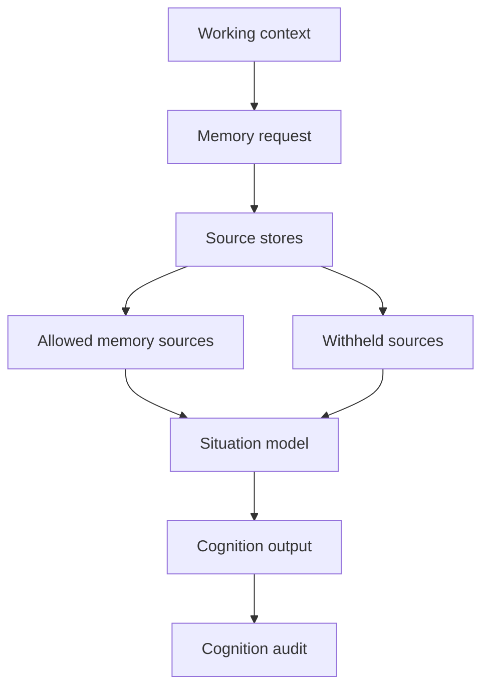

# Cognition And Relationship

> Status: Active design contract for companion cognition, relationship memory,
> and memory-surface governance. Code and schemas remain the exact truth.

Primary map: [Cognition And Decision](./cognition-decision-map.md).

Cognition is the layer that turns current input, memory, relationship facts,
runtime state, and attention context into a situation PulSeed can safely use.

Relationship memory is not "all personal data." It is a governed surface: facts
with roles, allowed uses, forbidden uses, lifecycle, correction state, and
surface projection rules.

## Implementation Anchors

- `src/runtime/cognition/`
- `src/platform/profile/relationship-profile.ts`
- `src/platform/profile/governed-memory.ts`
- `src/platform/profile/user-md-profile-import.ts`
- `src/platform/corrections/`
- `src/platform/knowledge/knowledge-manager-agent-memory.ts`
- `src/runtime/store/relationship-profile-proposal-state-migration.ts`

## Caller Paths

Current cognition caller paths include:

- chat user turn
- resident proactive check
- long-running task turn

Personal-agent caller paths are broader and include chat gateway turns, TUI
turns, scheduled wakes, resident proactive checks, goal-gap task generation,
runtime control, notifications, memory correction, reflection, task execution,
restart recovery, explicit user commands, and external signals.

The caller path matters because the same memory may be allowed for one use and
forbidden for another.

## Working Context

Working context snapshots include:

- input ref
- current text ref
- route ref
- reply target ref
- session ref
- turn start time
- language hint
- explicit guarantee that hidden prompt content is not materialized

This keeps user-visible context separate from host-owned runtime state.

## Memory Requests

Memory requests declare intended uses:

- runtime grounding
- user-facing reference
- behavioral inhibition
- goal planning
- proactive action candidate
- attention prioritization
- ask for confirmation
- reflection input

Requests require surface projection and disallow side-effect authorization or
sensitive content by default.

## Relationship Fact Roles

Relationship facts may represent:

- preference
- boundary
- promise
- intervention policy
- notification preference
- open tension

Allowed uses are narrow:

- tone adaptation
- behavioral inhibition
- ask for confirmation
- user-facing reference

The design intentionally avoids using relationship facts as unrestricted
instructions.

## Lifecycle And Correction

Relationship and memory sources carry lifecycle state:

- active
- matured
- stale
- superseded
- retracted
- deleted
- quarantined

Correction state can be current, corrected, superseded, retracted, or unknown.

Withheld reasons include stale, superseded, corrected, sensitive, deleted,
quarantined, forbidden use, and missing surface projection.

## Situation Model

The situation model should answer:

- what is happening now
- what the user likely needs
- what memory is relevant and allowed
- what memory is withheld and why
- what targets may be stale
- what conflicts or uncertainties exist
- which policy refs apply

It should not directly authorize external action. Authorization belongs to
runtime control, capability decisions, approval, and intervention policy.

## Relationship Repair

Repair paths include:

- correct
- suppress
- revoke
- forget

These paths must be represented as durable memory operations, not just prompt
instructions. A corrected relationship fact should stop shaping behavior where
the correction forbids it.

## Design Boundary

PulSeed can sound personal only if memory use is governed. A friend-like surface
that uses stale, sensitive, or forbidden memory is worse than a generic tool.

Therefore cognition should optimize for:

- accurate allowed use
- explicit withholding
- correction recovery
- conflict visibility
- surface projection
- auditability
