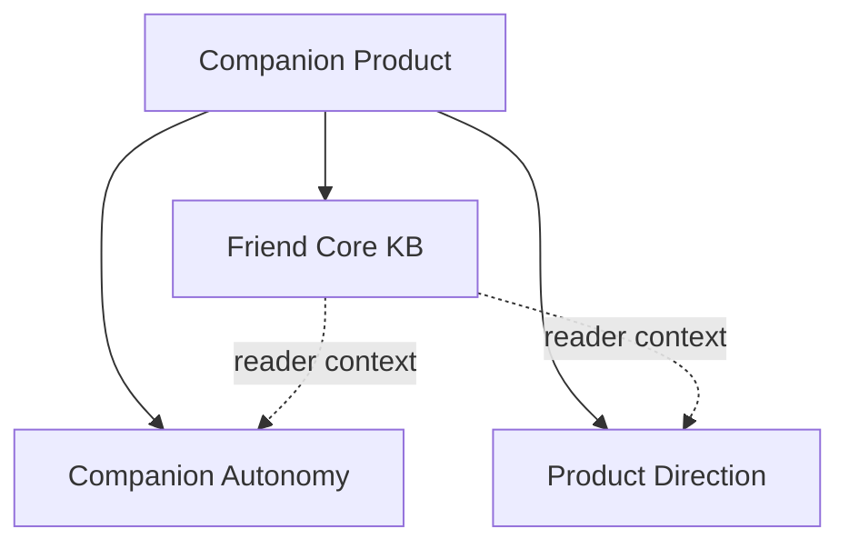

# Companion Product Map

This entry map groups companion behavior contracts and public product framing.

## Child Maps

- [Friend Core KB](./core-map.md)
- [Companion Autonomy](./companion-autonomy/companion-autonomy-map.md)
- [Product Direction](./product-direction/product-direction-map.md)
