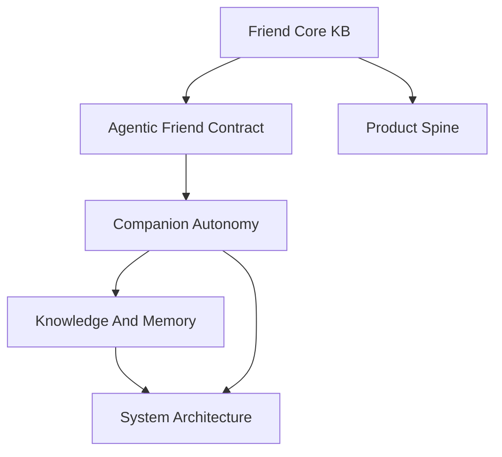

# Friend Core KB Map

Friend Core KB is the reader-facing center for PulSeed as a personal agentic
friend. It starts from companion decision semantics, then links out to memory,
runtime, and operator truth without making every terminal page point back here.

## Lead Concepts

- [Agentic Friend Contract](./product-direction/product-framing/agentic-friend.md)
- [Product Spine](./product-direction/product-framing/product-spine.md)

## Cluster Maps

- [Companion Autonomy](./companion-autonomy/companion-autonomy-map.md)
- [Knowledge And Memory](./knowledge-memory/knowledge-memory-map.md)
- [System Architecture](./system-architecture/system-architecture-map.md)

## Reading Rule

Use this map when the question is "what kind of friend is PulSeed becoming?"
Use [Use PulSeed](./use-pulseed-map.md) when the question is "what can I run
today?" Current command truth stays in the operating command references, and
implementation truth stays in code, schemas, and tests.
