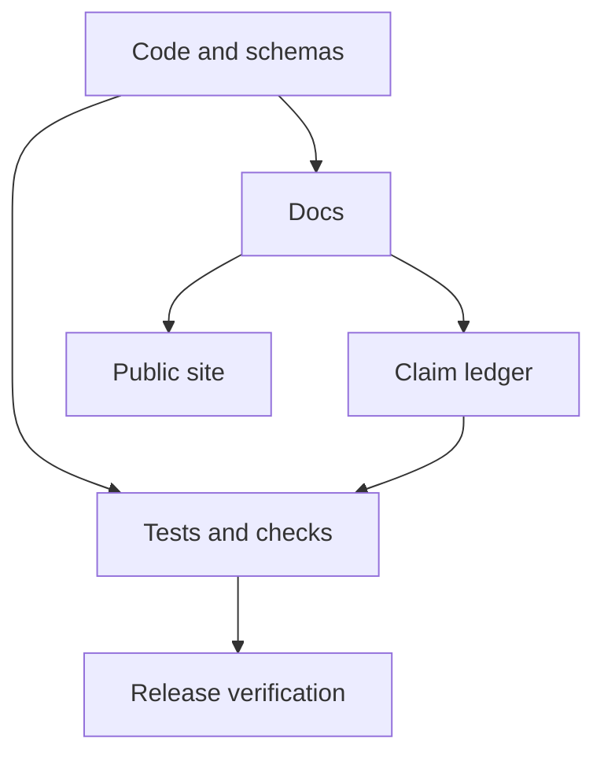

# Verification And Docs Truth

> Status: Active operations and documentation-truth contract. This page explains
> how PulSeed keeps implementation, docs, release checks, and public claims in
> sync.
> Doc status: active_design_contract
> Grounding use: current_truth

Primary map: [Operations Contracts](./operations-contracts-map.md).

PulSeed treats documentation truth as part of product completeness. A personal
agentic friend cannot be trusted if public docs overclaim capability, hide
boundaries, or drift from runtime behavior.



## Implementation Anchors

- `scripts/check-docs.mjs`
- `scripts/check-public-contracts.mjs`
- `scripts/check-database-first-legacy-stores.mjs`
- `docs/product-direction/product-boundaries/claim-ledger.md`
- `docs/product-direction/product-boundaries/completion-matrix.md`
- `package.json`
- `tests/contracts/product-completion-gauntlet.test.ts`

## Docs Check

`npm run check:docs` validates:

- missing Markdown links
- status banners for product/design docs
- retired thin docs paths
- current-doc links into deep design internals
- product completion matrix shape
- product claim ledger shape
- claim source text presence
- evidence ref validity
- design folder depth
- Markdown-only docs tree
- selected public-polish guardrails such as internal issue/slice wording and
  stale-current headings in history

This check is intentionally product-facing, not just a link checker. It validates
selected high-risk claims and structural boundaries; it is not a full semantic
proof of every public sentence.

## Release Gate

`verify:release` runs:

- docs check
- typecheck
- boundary lint
- all test lanes
- production dependency audit
- packaged artifact verification
- public contract check

Docs are part of release safety because user expectations and runtime behavior
must match.

## Claim Ledger

The claim ledger records selected claims from README, start, operate, reference,
product, and design docs.

For each claim it stores:

- ID
- claim class
- claim kind
- source file and source text
- normalized claim
- evidence refs when required

The ledger must include current behavior, operator/debug behavior, design-only
direction, boundary/migration claims, and unsupported-overclaim negatives.

## Completion Matrix

The completion matrix is a human-readable companion to the ledger. It describes
scenario classes and product boundaries.

It should keep the table contract:

```text
| Scenario | Class | Current coverage | Product boundary |
```

## DB-First State Ownership

Typed SQLite/control stores own current runtime truth; file and debug exports
are compatibility or operator views.

`doctor --repair` is the compatibility boundary for legacy runtime state.

This boundary is checked by `check-database-first-legacy-stores` and surfaced in
runtime-state docs.

## Public Current Docs

Current operating docs include README, start, operate, concepts, architecture,
and reference docs. They should avoid deep design links except the design index.

This prevents a first-time user from reading design direction as current
operating behavior.

## Design Docs

Design docs are public but status-bounded. They can describe architecture
direction and implementation contracts, but current behavior claims still need
code or test evidence.

Design docs should:

- include status banners
- use implementation anchors
- include diagrams when helpful
- use the one-level category folder rule
- avoid stale proposal language
- avoid treating old architecture as current core

## Verification Principle

When unsure, prefer:

1. running code and actual file contents
2. test results
3. type definitions and schemas
4. recent git history
5. docs and comments

Docs should help readers understand the system. They should not ask readers to
trust the docs more than the code.
