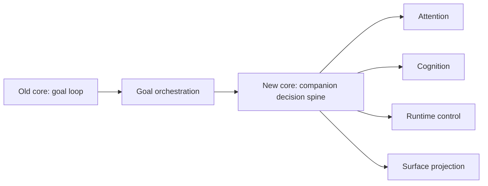

# Legacy Design Map

> Status: Historical migration map. This page explains how the previous deep
> design tree maps into the current one-level public design corpus.

The previous design tree grew around the original goal-loop architecture. It had
valuable material, but it mixed product direction, active implementation
contracts, proposals, audit notes, and historical pages across uneven folder
depths.

The current design corpus flattens the public structure:

```text
docs/design/<category>/<page>.md
```

## Why The Tree Changed

The old shape included paths like:

```text
docs/design/core/autonomy/companion-autonomy-spine.md
docs/design/core/loop/drive-system.md
docs/design/execution/interaction/codex-like-interaction-contract.md
docs/design/infrastructure/runtime/runtime-control-plane.md
docs/design/infrastructure/platform/database-first-state-ownership.md
```

The content was too deep and too mixed for the LP/docs site to index cleanly.
It also kept "core" overloaded with both original loop mechanics and newer
friend-like companion design.

## New Mapping

| Old area | New home |
| --- | --- |
| core/autonomy | `companion/` and `runtime/` |
| core/cognition | `cognition/` |
| core/loop | `loop/` plus `execution/goal-orchestration.md` |
| core/tools | `tools/`, `execution/agent-loop-tools.md`, and `capabilities/` |
| execution/interaction | `interaction/` plus `surfaces/chat-tui-gateway.md` |
| execution/planning | `planning/` plus `execution/goal-orchestration.md` |
| execution/context | `context/`, `cognition/`, and `surfaces/` |
| goal | `goal/` plus `execution/goal-orchestration.md` |
| infrastructure/runtime | `runtime/` |
| infrastructure/platform | `platform/` plus `operations/verification-doc-truth.md` |
| infrastructure/extensions | `extensions/`, `capabilities/`, and `runtime/` |
| knowledge | `knowledge/`, including `knowledge/soil-dream-learning.md` |
| personality | `personality/`, `companion/agentic-friend.md`, and product docs |
| archive/audits | `history/` |

## Content Policy

The rewrite keeps useful old pages, but places them under one-level public
categories so the docs site can index them consistently. New overview pages are
the first-read path; restored detailed pages remain available when they explain
a distinct design concern, implementation rationale, or historical decision.

Do not recreate the old deep paths. When a design page is added or restored,
place it at `docs/design/<category>/<page>.md` and give it a status banner that
tells readers whether it is an active contract, public design reference, or
historical context.

## Core Rebalance Result

The most important conceptual move is:



Long-running goal pursuit remains a powerful capability, but the product is
being shaped around a friend-like agent that can decide when and how to use that
capability.

## Fixture Move

The Codex-like interaction golden JSON is no longer stored under `docs/`.
It lives under `tests/fixtures/` because docs are public Markdown while test
fixtures are machine artifacts.

## Migration Rule

If an old design page is needed again:

1. identify the current implementation anchor
2. choose exactly one category folder
3. write a public Markdown page with a status banner
4. include diagrams and implementation references
5. avoid recreating deep folder hierarchies
