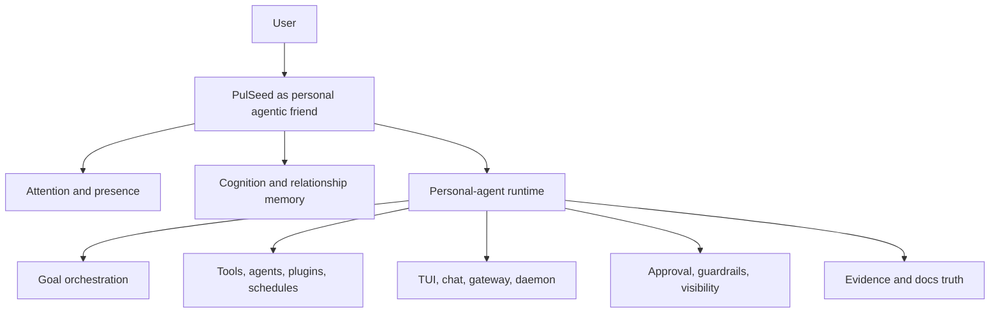

# PulSeed Design Corpus

> Status: Public design index for the current repository. This page is a map of
> public architecture and design documents, not a runtime command reference. Use
> [Runtime](../operate/runtime.md) and [Status](../operate/status.md) for current
> operating behavior.

PulSeed is now designed around **Your personal agentic friend**: software that can
stay with one person over time, remember what matters, notice when context
changes, and bring the right capability into the moment without becoming noisy,
servile, or unsafe.

The original long-running goal agent is still important, but it is no longer the
only center of gravity. Goal orchestration is one capability inside a broader
friend-like runtime: attention, relationship memory, permission, surfaces,
runtime control, verification, and quiet background preparation.



## Start Here

1. [Product Spine](product/product-spine.md)
2. [Agentic Friend Contract](companion/agentic-friend.md)
3. [Attention And Presence](companion/attention-presence.md)
4. [Personal-Agent Runtime](runtime/personal-agent-runtime.md)
5. [Control, Daemon, And Eventing](runtime/control-daemon-eventing.md)
6. [Goal Orchestration](execution/goal-orchestration.md)
7. [Soil, Dream, And Learning](knowledge/soil-dream-learning.md)
8. [Approval And Guardrails](safety/approval-guardrails.md)
9. [Verification And Docs Truth](operations/verification-doc-truth.md)

These pages are the shortest public reading path. They explain the current
product direction, the active design contracts, and the runtime boundary without
requiring readers to traverse the restored detailed design corpus.

## Active Contracts And Current Synthesis

Use these when you need the design/specification pages closest to current
runtime behavior:

- [Product Spine](product/product-spine.md)
- [Agentic Friend Contract](companion/agentic-friend.md)
- [Cognition And Relationship](cognition/cognition-and-relationship.md)
- [Personal-Agent Runtime](runtime/personal-agent-runtime.md)
- [Control, Daemon, And Eventing](runtime/control-daemon-eventing.md)
- [Capability Runtime And Plugins](capabilities/capability-runtime-plugins.md)
- [Chat, TUI, And Gateway](surfaces/chat-tui-gateway.md)
- [Approval And Guardrails](safety/approval-guardrails.md)
- [Verification And Docs Truth](operations/verification-doc-truth.md)

## Detailed References By Category

The first few pages in each category are current synthesis pages. The remaining
pages preserve the previous detailed design corpus in the new flat layout.

### Capabilities

- [Capability Runtime And Plugins](capabilities/capability-runtime-plugins.md)

### Cognition

- [Cognition And Relationship](cognition/cognition-and-relationship.md)
- [Companion Cognitive Architecture](cognition/companion-cognitive-architecture.md)

### Companion

- [Agentic Friend Contract](companion/agentic-friend.md)
- [Attention Metabolism And Initiative](companion/attention-metabolism-initiative.md)
- [Attention And Presence](companion/attention-presence.md)
- [Companion Autonomy Implementation Map](companion/companion-autonomy-implementation-map.md)
- [Companion Autonomy Spine](companion/companion-autonomy-spine.md)
- [Companion Behavior Evals](companion/companion-behavior-evals.md)
- [Companion Character Policy Projection](companion/companion-character-policy.md)
- [Companion Decision Contract](companion/companion-decision-contract.md)
- [Companion Gadget Planning](companion/companion-gadget-planning.md)
- [Core Companion Memory Projection](companion/core-companion-memory-projection.md)
- [Dream Mode Design](companion/dream-mode.md)
- [Living Autonomy Direct-Path Inventory](companion/living-autonomy-direct-path-inventory.md)
- [Peer Initiative](companion/peer-initiative.md)
- [Relationship Memory And Surface](companion/relationship-memory-surface.md)
- [Companion Surface Closure](companion/section9-companion-surface-closure.md)

### Context

- [PulSeed — External Data Source Integration Design](context/data-source.md)
- [Session and Context Management](context/session-and-context.md)

### Execution

- [AgentLoop And Tools](execution/agent-loop-tools.md)
- [Goal Orchestration](execution/goal-orchestration.md)

### Extensions

- [Plugin Architecture Design](extensions/plugin-architecture.md)
- [Plugin Development Guide](extensions/plugin-development-guide.md)
- [Schedule Engine Design](extensions/schedule-engine.md)

### Goal

- [PulSeed — Defining the Execution Boundary](goal/execution-boundary.md)
- [Goal Ethics Gate Design](goal/goal-ethics.md)
- [Goal Negotiation Mechanism Design](goal/goal-negotiation.md)
- [Goal Refinement Pipeline](goal/goal-refinement-pipeline.md)
- [Goal Tree Design](goal/goal-tree.md)

### Interaction

- [Codex-Like User Interaction Contract](interaction/codex-like-interaction-contract.md)
- [Conversational Approval Contract](interaction/conversational-approval.md)
- [Exact Protocol Grammar Boundaries](interaction/exact-protocol-boundaries.md)
- [Gateway Progress Narration](interaction/gateway-progress-narration.md)
- [`/tend` — Chat-to-DurableLoop Handoff Command](interaction/tend-command.md)

### Knowledge

- [Hierarchical Context Memory Design](knowledge/hierarchical-memory.md)
- [Hypothesis Verification Mechanism Design](knowledge/hypothesis-verification.md)
- [Knowledge Acquisition Design](knowledge/knowledge-acquisition.md)
- [Knowledge Transfer Design](knowledge/knowledge-transfer.md)
- [Learning Pipeline Design](knowledge/learning-pipeline.md)
- [Memory Lifecycle Design](knowledge/memory-lifecycle.md)
- [Soil System Design](knowledge/soil-system.md)

### Loop

- [Drive Scoring Design](loop/drive-scoring.md)
- [Drive System](loop/drive-system.md)
- [Gap Calculation Design](loop/gap-calculation.md)
- [Observation System Design](loop/observation.md)
- [Satisficing Design — Judging "Good Enough"](loop/satisficing.md)
- [Stall Detection Design](loop/stall-detection.md)
- [State Vector Design](loop/state-vector.md)
- [Time Horizon Engine Design](loop/time-horizon.md)
- [WaitStrategy Design Document](loop/wait-strategy.md)

### Memory

- [Soil, Dream, And Learning](knowledge/soil-dream-learning.md)

### Operations

- [Verification And Docs Truth](operations/verification-doc-truth.md)

### Personality

- [PulSeed Brand Design Guide](personality/brand.md)
- [PulSeed Character Design](personality/character.md)
- [Curiosity (Meta-Iteration) Design](personality/curiosity.md)
- [Trust and Safety Design](personality/trust-and-safety.md)

### Planning

- [Multi-Agent Delegation Design](planning/multi-agent-delegation.md)
- [Portfolio Management Design — Strategy Discovery, Parallel Execution, and Rebalancing](planning/portfolio-management.md)
- [Task Lifecycle Design](planning/task-lifecycle.md)

### Platform

- [Database-First State Ownership](platform/database-first-state-ownership.md)
- [LLM Fault Tolerance Design](platform/llm-fault-tolerance.md)
- [Reporting Design](platform/reporting.md)
- [Token Optimization Design](platform/token-optimization.md)

### Product

- [Product Spine](product/product-spine.md)
- [Public Boundaries](product/public-boundaries.md)

### Runtime

- [Companion Capability Runtime](runtime/companion-capability-runtime.md)
- [Control, Daemon, And Eventing](runtime/control-daemon-eventing.md)
- [Daemon-Client Architecture](runtime/daemon-client-architecture.md)
- [Personal-Agent Runtime](runtime/personal-agent-runtime.md)
- [Runtime Auth, Browser Session, And Guardrail Control Model](runtime/runtime-auth-browser-guardrails.md)
- [Runtime Auto-Recovery](runtime/runtime-auto-recovery.md)
- [Runtime Control Plane](runtime/runtime-control-plane.md)

### Safety

- [Approval And Guardrails](safety/approval-guardrails.md)

### Surfaces

- [Chat, TUI, And Gateway](surfaces/chat-tui-gateway.md)

### Tools

- [Self-Knowledge Tools Design](tools/self-knowledge.md)
- [PulSeed Tool System Design — Tools as the Universal Capability Layer](tools/tool-system.md)
- [Tool Integration Design](tools/write-tool-integration.md)

## Historical Context

These pages are public design history. They are useful for understanding why the
architecture moved, but they are not the current reader path for implementation
behavior:

- [Documentation Rearchitecture Audit - 2026-05-11](history/20260511-docs-rearchitecture.md)
- [Companion Capability Runtime Gap Audit](history/companion-capability-runtime-gap-audit.md)
- [Historical Design Context](history/index.md)
- [Legacy Design Map](history/legacy-map.md)
- [PulSeed — Multi-Channel Runtime](history/multi-channel-runtime.md)
- [Prompt Context Architecture — LLM Prompt Utilization Design for Hierarchical Memory](history/prompt-context-architecture.md)

## Folder Rule

Every public design page lives at exactly one folder under `docs/design/`:

```text
docs/design/<category>/<page>.md
```

There are no nested design folders below the category. This keeps the design
corpus easy for the LP/docs site to index as public Markdown.

## Source Of Truth

Use this reliability order when docs and code disagree:

1. running code and actual file contents
2. test results
3. type definitions and schemas
4. recent git history
5. docs and comments

Design docs explain the intended architecture and the implemented contracts they
are grounded in. They do not override the current code, CLI registry, runtime
schemas, or tests.
