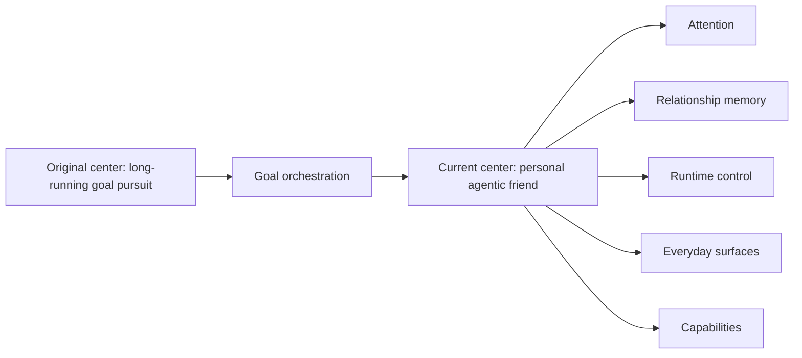
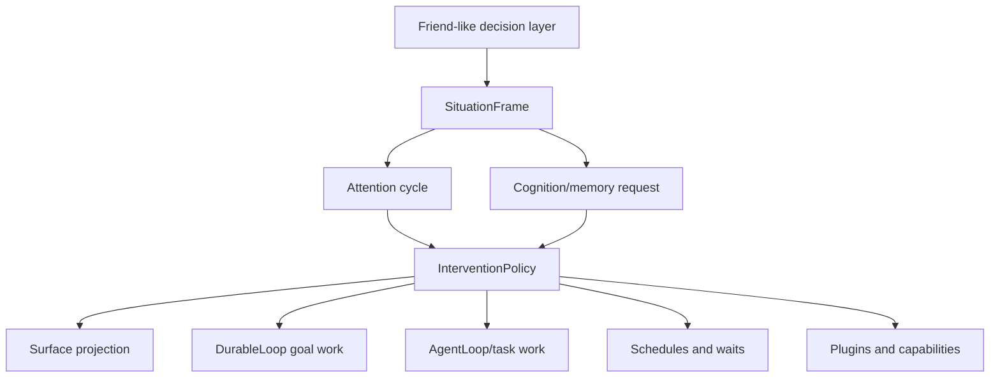

# Product Spine

> Status: Product design spine grounded in the current implementation. This page
> explains PulSeed's public direction and architecture balance; it is not a
> complete operating guide.

PulSeed's product category is **Your personal agentic friend**.

That phrase is deliberately different from "assistant", "task runner", and
"long-running goal orchestrator":

- **personal**: the runtime is organized around one user's context, preferences,
  boundaries, relationships, and goals.
- **agentic**: PulSeed can prepare, delegate, verify, schedule, remember, and ask
  for approval through typed runtime paths.
- **friend**: it should feel like a steady peer that notices and helps, not a
  servile tool, engagement loop, product tutorial bot, or authority figure.

The earliest PulSeed architecture was goal-first: accept a goal, decompose it,
run loops, use agents, and verify progress. That remains a useful engine. The
current architecture adds the missing companion layer around it: attention,
cognition, relationship memory, peer initiative, runtime control, surface
projection, and safety boundaries.

## Current Product Contract

PulSeed should help a user across time by doing five things well:

| Contract | Current implementation anchor | Product meaning |
| --- | --- | --- |
| Remember | `src/runtime/cognition/`, `src/platform/profile/`, `src/platform/soil/` | It can use durable context without replaying every old event as instruction. |
| Notice | `src/runtime/attention/`, `src/platform/observation/` | It can form candidate concerns from state, events, schedules, and signals. |
| Decide | `src/runtime/personal-agent/`, `src/runtime/control/` | It records why an action, hold, block, or confirmation was chosen. |
| Act or ask | `src/tools/`, `src/orchestrator/execution/`, `src/runtime/gateway/` | It can delegate bounded work or ask for permission through the right surface. |
| Stay safe | `src/runtime/guardrails/`, `src/runtime/store/`, approval stores | It keeps authority, staleness, visibility, and permission separate. |

## What Belongs In Core Now

The "core" of PulSeed is no longer just the loop that executes a goal. The core
is the **decision spine for a companion runtime**.

Core responsibilities:

- assembling the current situation
- selecting what deserves attention
- keeping relationship memory usable but bounded
- deciding whether to speak, prepare, wait, ask, or act
- routing work through runtime-control and tool authority
- exposing normal surfaces without leaking debug internals
- preserving auditability for operator/debug surfaces

Supporting responsibilities:

- goal decomposition and strategy management
- AgentLoop execution
- plugins and external integrations
- schedule execution
- CLI and diagnostic commands
- docs/release verification

Goal orchestration is still critical, but it is a capability the friend can use.
It is not the whole product.

## Architecture Balance

The product should be judged by whether this spine produces helpful, bounded,
understandable behavior:

- Did PulSeed notice something that matters?
- Did it stay quiet when attention was weak or costly?
- Did it ask before crossing a permission boundary?
- Did it use the right capability instead of exposing internal plumbing?
- Did it remember corrections and avoid stale target reuse?
- Did it preserve a trace when an operator needs to inspect the decision?

## Current Wedge

The code-backed wedge remains long-running local orchestration:

- `DurableLoop` keeps goals moving over iterations and waits.
- `AgentLoop` performs bounded tool-using work.
- `TaskLifecycle` creates, executes, verifies, and records work.
- daemon/schedule/runtime stores preserve continuity under `~/.pulseed/`.
- ToolExecutor and runtime-control paths provide explicit authority points.

The wedge matters because a companion without durable action is only a chat
persona. PulSeed's product direction needs the ability to move real work, but
the current docs should not claim every companion scenario is complete.

## Non-Goals

PulSeed should not become:

- a random proactive-message bot
- an engagement optimizer
- a personality wrapper over a task runner
- a hidden autonomous actor with no inspection path
- a tool marketplace with weak permission semantics
- a project-management UI that does not execute or verify

The product should feel warmer than a scheduler and more bounded than a generic
autonomous agent.

## Public Claim Rule

Public docs can say PulSeed is being built toward a personal agentic friend.
They must distinguish that direction from current operating behavior.

Current behavior claims need code or test evidence. Design direction can be
ambitious, but it must be marked as design direction and must not imply that
medical, financial, legal, business, or sensor workflows are turnkey today.
