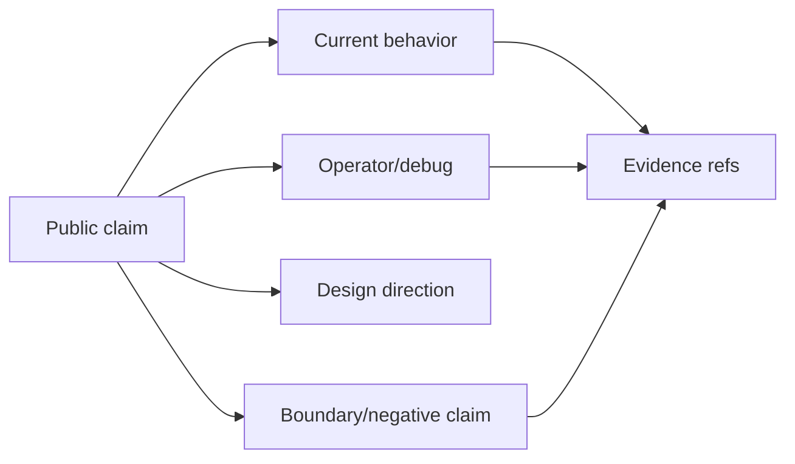

# Public Boundaries

> Status: Public documentation boundary contract. This page explains how PulSeed
> keeps public design docs, current behavior docs, and operator/debug docs aligned
> with implementation truth.

PulSeed docs are public, including design documents. Public does not mean every
design claim is current behavior. The docs have to expose the architecture while
preserving a strong boundary between:

| Class | Meaning | Example |
| --- | --- | --- |
| Current behavior | Code-backed behavior a user can run now | `pulseed`, `pulseed run`, daemon, schedules, runtime diagnostics |
| Operator/debug behavior | Implemented surfaces intended for inspection or integration | runtime graph, traces, evidence, policy details |
| Design direction | Product and architecture direction grounded in code but not fully user-ready | lifelong companion scenarios |
| Boundary | Explicit warning or scope rule | local execution is not an OS sandbox |
| Unsupported overclaim | A claim docs must reject | turnkey personal-life automation product |



## Docs Truth Contract

The documentation system treats docs as part of product quality:

- current operating docs should describe behavior that exists in code
- design docs should be public and ambitious, but status-bounded
- normal user docs should not link directly into deep design internals
- operator/debug docs may expose trace IDs, policy labels, and diagnostic state
- design pages should include implementation anchors when they describe current
  contracts

The machine-checkable ledger now lives in [Product Claim Ledger](../../product/claim-ledger.md).
It records selected product claims, their class, source text, and evidence refs.

## Markdown-Only Public Docs

All public documentation artifacts under `docs/` should be Markdown. Test
fixtures and machine-only JSON should live outside the docs tree unless they are
embedded in a Markdown document for public inspection.

This is important for the docs site because it can index a uniform public corpus:

```text
docs/
  index.md
  product/*.md
  operate/*.md
  reference/*.md
  design/<category>/*.md
```

## Design Folder Contract

Every design document is exactly one category folder below `docs/design/`.

Allowed:

```text
docs/design/runtime/personal-agent-runtime.md
docs/design/companion/attention-presence.md
docs/design/knowledge/soil-dream-learning.md
```

Not allowed:

```text
docs/design/core/autonomy/companion-autonomy-spine.md
docs/design/infrastructure/runtime/runtime-control-plane.md
```

The old deep tree had good content, but it was hard for the LP/docs site to
index consistently. The flatter tree makes each page public, direct, and
category-addressable.

## Current Behavior Sources

Use current behavior docs first:

- [Runtime](../../operate/runtime.md)
- [Status](../../operate/status.md)
- [Configuration](../../operate/configuration.md)
- [CLI Reference](../../reference/cli.md)
- [Runtime State](../../reference/runtime-state.md)

Design docs can link to these pages, but current operating docs should avoid
deep design links except the design index.

## Evidence Sources

Good current-behavior evidence includes:

- `src/interface/cli/cli-command-registry.ts`
- `src/runtime/types/*`
- `src/runtime/store/*`
- `src/runtime/personal-agent/*`
- `src/runtime/control/*`
- `src/runtime/gateway/*`
- `src/orchestrator/loop/*`
- `src/orchestrator/execution/*`
- `tests/contracts/*`
- package scripts such as `check:docs`, `typecheck`, and `test:contracts`

When evidence conflicts, code and tests win over docs.

## Public Surface Rule

Normal user-facing pages should avoid raw internal concepts unless they are
needed to explain behavior. Operator/debug pages and design pages can expose
those internals with status banners and context.

The same rule appears in runtime design:

- normal surfaces show the next best safe action and brief reason
- operator/debug surfaces can show readiness, admission, autonomy, evidence, and
  trace details

That split lets PulSeed be transparent without making everyday use feel like a
debug console.
