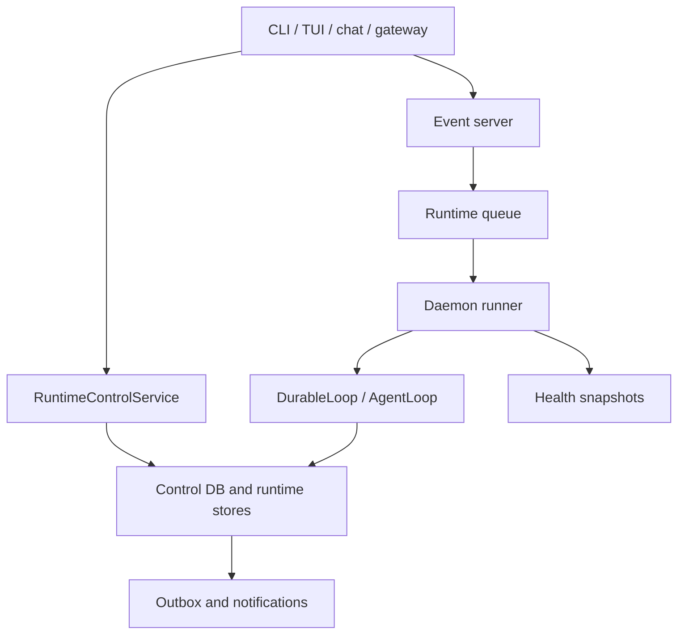
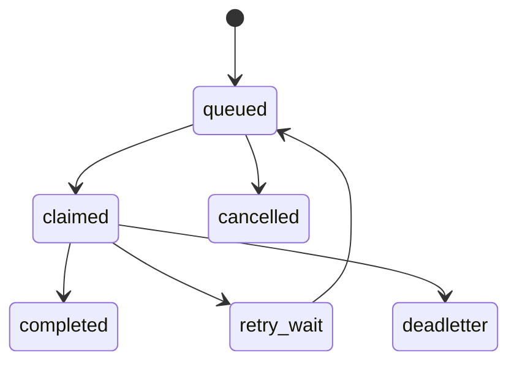

# Control, Daemon, And Eventing

> Status: Active runtime design contract. This page covers resident runtime,
> control operations, eventing, schedules, queues, health, and replay semantics.

The resident runtime lets PulSeed keep context and work alive outside a single
interactive turn. It hosts daemon state, event ingestion, schedules, queues,
gateway channels, runtime health, approval broadcast, and recovery.

## Implementation Anchors

- `src/runtime/daemon/`
- `src/runtime/event/`
- `src/runtime/queue/`
- `src/runtime/control/`
- `src/runtime/store/`
- `src/runtime/schedule/`
- `src/runtime/watchdog.ts`
- `src/runtime/leader-lock-manager.ts`
- `src/runtime/goal-lease-manager.ts`

## Daemon Responsibilities

The daemon is responsible for:

- resident goal work
- schedule execution
- gateway ingestion
- runtime event handling
- approval and notification coordination
- health snapshots
- recovery and restart behavior
- maintenance
- resident attention, curiosity, dream, and proactive checks

It is not a hidden unlimited executor. It routes effects through admission,
control, queues, leases, ToolExecutor, and stores.

## Runtime Control

Runtime control operations include:

- restart daemon or gateway
- reload config
- inspect, pause, resume, cancel, or finalize runs
- inspect and change permission boundaries
- inspect companion state
- enter or leave quiet mode
- pause or resume proactivity
- suspend or resume the companion
- stop quiet work or watches
- require confirmation for proactivity
- inspect or summarize sessions
- control auth handoff, browser session, guardrail, or backpressure automation

Operations carry actor, reply target, risk, expected health, state, result, and
target refs. This keeps control actions auditable and replyable.

## Queue And Replay

Runtime envelopes carry kind, name, source, goal, correlation, idempotency,
dedupe key, priority, payload, created time, TTL, and attempts.

Queue records can be queued, claimed, retry-wait, completed, deadletter, or
cancelled.

Replay correctness matters because repeated legitimate events must not collapse
unless they share explicit idempotency or dedupe semantics.

## Event Server

The event server receives external and internal event/command surfaces. It
routes through server auth, body parsing, file ingestion, command handling,
trigger mapping, snapshot reading, and SSE replay.

Accepted external signals should produce a personal-agent trace before they
become task candidates or runtime actions.

## Schedule Layers

Current schedule layers:

- heartbeat
- probe
- cron
- goal trigger

Implemented presets include daily brief, weekly review, dream consolidation,
Soil publish, and goal probe.

Wait-resume projections are internal runtime entries and are hidden from normal
schedule lists unless explicitly requested by operator/debug commands.

## Health

Health is not just "the process exists." The current health model separates:

- process
- child activity
- log freshness
- artifact freshness
- metric freshness
- metric progress
- blocker status
- artifact expectation
- resumability

Health summaries include alive-and-progressing, alive-but-waiting,
alive-but-stalled, dead-but-resumable, and dead-needs-intervention.

## Safe Pause

Safe pause records capture active goals, queued goals, current mode, candidate
evidence refs, artifact refs, next action, supervisor state, and background run
IDs.

This lets PulSeed pause and resume without losing the runtime state needed for
inspection or recovery.

## DB-First Runtime Truth

Typed SQLite/control stores own current runtime truth; file and debug exports
are compatibility or operator views.

That sentence is an architectural boundary. It prevents docs, file snapshots,
or legacy JSON exports from becoming alternate runtime authorities.
