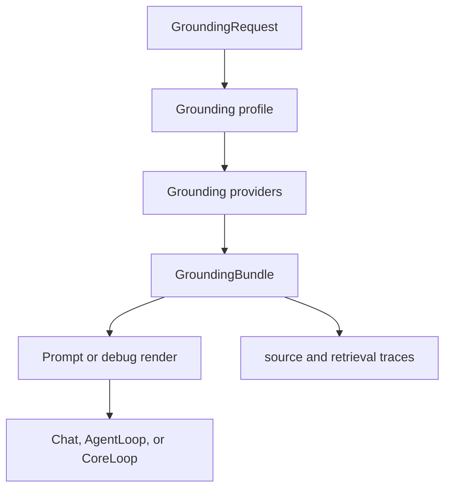
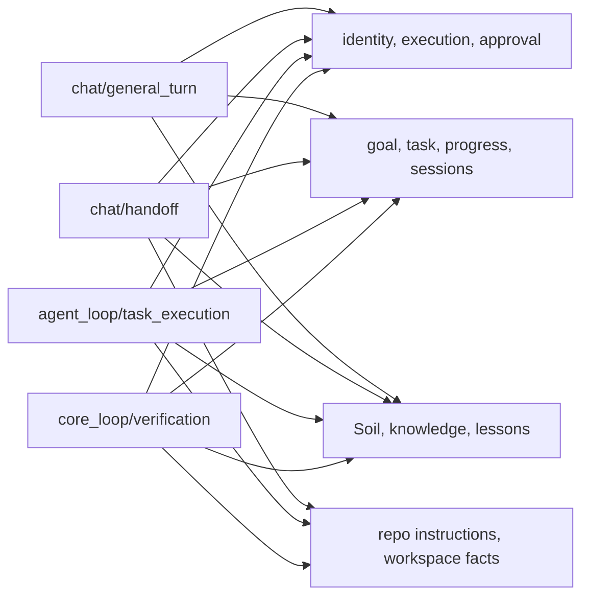
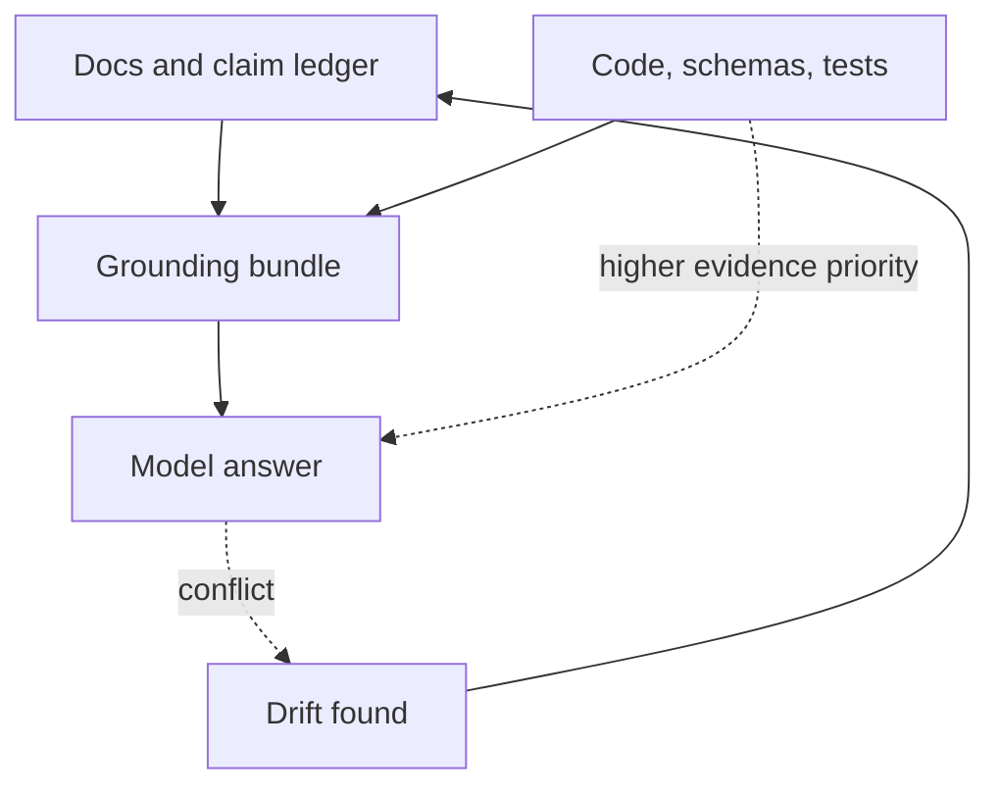

# Self-Grounding Contract

> Status: Active design contract with current implementation anchors. This page
> describes how PulSeed grounds itself before chat, task execution, verification,
> and handoff surfaces.
> Doc status: active_design_contract
> Grounding use: current_truth

Primary map: [Tool Substrate](./tool-substrate-map.md).

PulSeed's self-knowledge is no longer just a set of ad hoc self-inspection
tools. The current contract is a grounding gateway: each surface asks for a
profile, the gateway assembles allowed sections from typed providers, and the
caller receives a bundle with renderable prompt text plus source traces.

## Current Implementation Anchors

- `src/grounding/gateway.ts` owns provider ordering, static-section caching,
  dynamic section assembly, token metrics, and source trace collection.
- `src/grounding/profiles.ts` owns which sections are included for chat,
  handoff, task execution, and verification.
- `src/interface/chat/grounding.ts` adapts the gateway into the legacy chat
  prompt shape for normal chat while preserving richer grounding for AgentLoop.
- `src/grounding/providers/soil-provider.ts` uses the production Soil query tool
  path and records retrieval provenance.
- `src/grounding/providers/knowledge-provider.ts` admits broader knowledge only
  for non-user-visible sinks or prefetched context, and adds relationship
  profile surface metadata.
- `src/tools/query/KnowledgeQueryTool/constants.ts` marks knowledge query as
  read-only self-grounding.

## Profile Matrix

Normal chat renders a compatibility prompt around identity, policy, goal state,
provider state, and plugins. Soil and broader knowledge sections are gated by
surface and sink: user-visible chat does not receive admitted Soil hits as raw
prompt context, while handoff, AgentLoop, and verification-oriented surfaces can
use richer runtime, workspace, Soil, and knowledge context through non-user-
visible grounding paths.

## Source Classes

| Source class | Current owner | Grounding role |
| --- | --- | --- |
| Identity and policy | `static-policy-provider.ts` | Stable self-description and operating boundary |
| Goals and tasks | state manager providers | Current work context |
| Runtime history | progress/session providers | Recent execution context for handoff and verification |
| Soil knowledge | `SoilQueryTool` through ToolExecutor | Durable memory retrieval with correction/admission checks |
| Knowledge query | caller-supplied query or prefetched context | Broader non-user-visible context |
| Relationship profile | profile retrieval and surface projection | Scoped personalization context |
| Docs truth | status banners, `doc_status`, `grounding_use`, claim ledger | Public KB material that can be used for self-grounding |

## Boundaries

- Code, schemas, and tests outrank docs when evidence conflicts.
- `doc_status` describes the maturity of a page. `grounding_use` describes how
  self-grounding should treat that page.
- User-visible chat should not receive raw knowledge-query context when the
  provider marks the sink as user-visible.
- Soil hits must pass status and correction checks before they are admitted into
  prompt grounding.
- Imported tools, plugins, and external MCP servers do not become trusted
  self-knowledge until their permission and runtime-control boundaries are
  verified.

## Production Caller Paths

Chat turns call `buildChatGroundingBundle()` and render a compatibility prompt
containing selected static and dynamic sections. AgentLoop task execution calls
the same gateway with task-execution purpose and a non-user-visible sink.
The gateway also defines a `core_loop/verification` profile for verification
surfaces that need source traces, retrieval ids, and runtime state. Existing
task verification paths may still use the task prompt gateway directly; moving
all verification calls through `GroundingGateway` is an implementation boundary,
not a completed guarantee on this page.

## Verification Anchors

- `src/grounding/__tests__/gateway.test.ts`
- `tests/contracts/surface-projection-protocol.test.ts`
- `tests/contracts/product-completion-gauntlet.test.ts`
- `scripts/check-docs.mjs`
- `docs/product-direction/product-boundaries/claim-ledger.md`

## Drift Checks

When changing self-grounding, check all of these:

- Whether the profile includes the right sections for the caller surface.
- Whether the source traces explain why the section was admitted.
- Whether user-visible sinks avoid raw operator or private knowledge context.
- Whether docs used for grounding carry valid `doc_status` and
  `grounding_use` metadata.
- Whether the claim ledger has evidence refs for current or operator claims.
