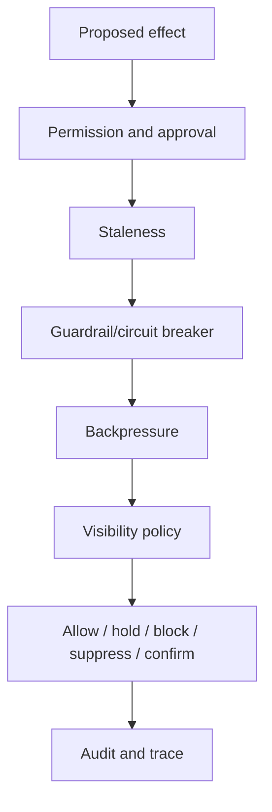

# Approval And Guardrails

> Status: Active design contract for approval, permission, guardrails,
> backpressure, auth handoff, browser sessions, and notification safety.
> Doc status: active_design_contract
> Grounding use: design_context

Primary map: [Approval Protocol](./approval-protocol-map.md).

Safety in PulSeed is not one switch. It is a stack of boundaries that preserve
friend-like helpfulness without hidden authority.

## Implementation Anchors

- `src/runtime/approval-broker.ts`
- `src/runtime/store/approval-store.ts`
- `src/runtime/permission-dialogue.ts`
- `src/runtime/permission-grant-decision.ts`
- `src/runtime/store/permission-grant-store.ts`
- `src/runtime/guardrails/`
- `src/runtime/interactive-automation/`
- `src/runtime/control/`
- `src/runtime/notification-routing.ts`
- `src/runtime/store/safe-pause-store.ts`

## Approval

Approval records carry:

- approval ID
- goal ID when scoped
- request envelope ID
- correlation ID
- state
- expiry
- origin channel, conversation, user, session, turn, and reply target
- response channel
- payload

Approval matching is typed and contextual. Freeform "yes" is not enough unless
it matches the current pending approval, sender, conversation, turn/session, and
confidence requirements.

## Permission Grants

Permission grants are capability-scoped. They should express what is included,
what is excluded, expiration, actor, surface, and target boundaries.

Permission should not be inferred from:

- installed plugin
- remembered user preference
- old approval in a different surface
- stale reply target
- debug-only capability state

## Auth Handoff And Browser Sessions

Interactive automation has explicit stores for:

- browser sessions
- runtime auth handoff
- default registry
- failure classification

Auth handoff and browser state are sensitive. Normal surfaces should avoid
leaking tokens, cookies, raw browser state, or handoff IDs unless explicitly in
operator/debug mode.

## Guardrails

Guardrails include:

- circuit breaker
- backpressure controller
- guardrail store
- backpressure limits

Guardrails can hold, suppress, or block operations when risk, failure rate,
resource pressure, or repeated bad outcomes cross thresholds.

## Notification Safety

Notification routing includes:

- do-not-disturb
- cooldown
- no-route handling
- channel filters
- notification interruption decisions
- outbox dedupe

Suppressed notifications should still leave a durable decision when relevant.
This lets operator/debug views explain why a message did not arrive.

## Visibility

Visibility policy answers:

- can the item be displayed normally?
- should it be hidden or redacted?
- is it inspectable?
- is it auditable?
- what policy ref explains the answer?

Visibility is separate from action authority. Something can be auditable but not
normal-surface visible.

## Safe Pause

Safe pause lets PulSeed stop or hold work while preserving enough context to
resume or inspect safely.

Safe pause is important for:

- emergency stop
- restart recovery
- policy changes
- user control changes
- daemon shutdown
- stale or risky work

## Review Checklist

For any action-bearing change, ask:

- What actor and surface requested this?
- What target is affected?
- What permission or approval proves authority?
- What happens if the target is stale?
- What is visible on normal surfaces?
- What is visible on operator/debug surfaces?
- Is replay idempotent?
- Is there a suppression or recovery path?
