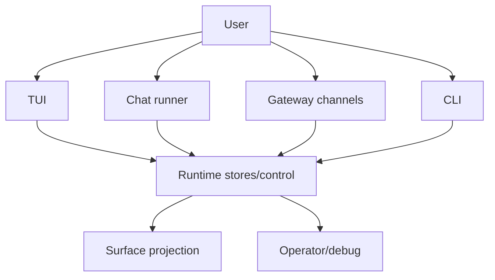

# Chat, TUI, And Gateway

> Status: Active design contract for PulSeed's user-facing and operator-facing
> surfaces. Exact command lists live in the runtime and reference docs.
> Doc status: active_design_contract
> Grounding use: design_context

Primary map: [Operator Narration](./operator-narration-map.md).

PulSeed has multiple surfaces, but they should feel like one companion runtime:

- interactive TUI
- CLI
- chat runner
- gateway channels
- daemon status
- runtime diagnostics
- schedules and notifications

## Implementation Anchors

- `src/interface/tui/`
- `src/interface/chat/`
- `src/interface/cli/`
- `src/runtime/gateway/`
- `src/runtime/channels/`
- `src/runtime/notification-dispatcher.ts`
- `src/runtime/gateway/non-tui-display-projector.ts`
- `src/interface/current-goal-summary.ts`

## Surface Split

| Surface | Primary role |
| --- | --- |
| TUI | everyday interactive terminal companion surface |
| Chat runner | conversational turns, slash commands, AgentLoop routing |
| CLI | scriptable commands, setup, diagnostics, automation |
| Gateway | external chat/channel ingress and delivery |
| Daemon status | resident runtime overview |
| Runtime commands | operator/debug inspection |

Normal surfaces should be calm and concise. Operator surfaces can be verbose and
diagnostic.

## Codex-Like Interaction Contract

PulSeed separates display text from structured host state.

Display text is what the user sees. Structured state includes approvals,
reply targets, stale route caches, runtime refs, tool traces, and other
host-owned data.

This separation prevents raw JSON, hidden state, or stale target details from
leaking into ordinary chat while preserving the data needed for safe routing.

## Reply Targets

Reply targets preserve:

- surface
- channel
- platform
- conversation ID
- message ID
- response channel
- outbox topic
- identity key
- user ID
- delivery mode
- metadata

Correct reply-target handling is critical for approvals, follow-ups, gateway
messages, and stale-target rejection.

## Progress And Presence

Progress narration should say what PulSeed is doing in user terms:

- checking current state
- preparing a draft
- waiting for approval
- running a bounded task
- verifying result
- holding because permission is missing

It should avoid pretending to know more than the runtime knows.

## TUI

The TUI is the default `pulseed` entry point. It hosts:

- chat composer and rendering
- approvals
- dashboard
- settings
- help
- diff view
- report view
- command handling
- markdown rendering
- terminal output
- presence art and theme

The TUI should prioritize current state and user control over decorative status
noise.

## Gateway

Gateway channels must preserve platform identity and policy. They should route
typed envelopes into PulSeed rather than directly mutating runtime state.

Gateway adapters include Telegram, Discord, Slack, Signal, WhatsApp, HTTP,
WebSocket, and channel adapter shells.

## Seedy Presence

Seedy presence is a projection, not the source of truth. It should summarize the
runtime state and companion posture without exposing raw trace internals by
default.

Good presence makes PulSeed feel continuous. Bad presence turns the surface into
a debugging dashboard.

## Stale Target Rejection

When a user replies to an old message, PulSeed must not silently apply the reply
to a previous target. It should ask for clarification or summarize without
resuming when the target is stale.

This is a core trust behavior for friend-like interaction.
