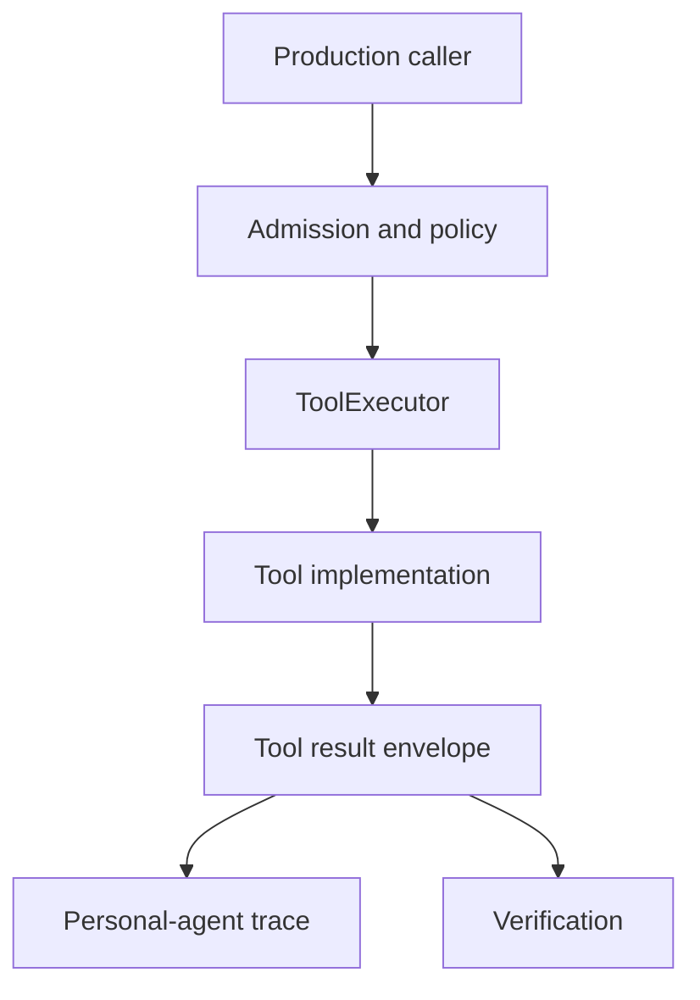
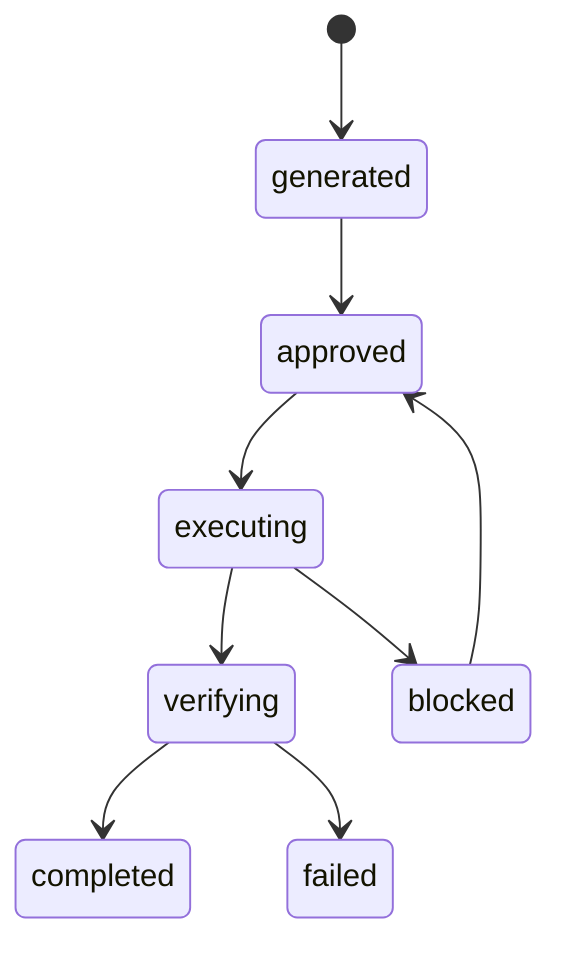

# AgentLoop And Tools

> Status: Active design contract for bounded execution, ToolExecutor admission,
> and production caller paths. Exact command behavior remains code-owned.
> Doc status: active_design_contract
> Grounding use: design_context

Primary map: [Planning Workflow](./planning-workflow-map.md).

AgentLoop is PulSeed's bounded tool-using executor. It is where PulSeed can
inspect, run tools, delegate, verify, and stop with a result inside a controlled
context.

ToolExecutor is the authority boundary that prevents production code from
calling mutating capabilities as informal helpers.

## Implementation Anchors

- `src/orchestrator/execution/agent-loop/`
- `src/orchestrator/execution/task/`
- `src/tools/`
- `src/tools/executor.ts`
- `src/tools/personal-agent-tool-trace.ts`
- `src/platform/tools/executor.ts`
- `tests/contracts/tool-file-write-boundary.test.ts`

## AgentLoop Responsibilities

AgentLoop owns bounded:

- tool selection
- tool call routing
- prompt context assembly
- turn history and compaction
- output formatting
- verification posture
- dogfood benchmarks
- model-client abstraction
- task-agent and chat-agent variants

It should not own long-term strategy, relationship memory policy, or runtime
permission state by itself. Those are higher-level runtime responsibilities.

## Tool Groups

Current tool groups include:

- filesystem
- system
- query
- network
- mutation
- schedule
- execution
- interaction
- media
- automation
- Kaggle

Tool availability depends on surface, policy, configuration, and permission.

## Production Caller-Path Rule

When runtime behavior crosses a boundary, tests should include at least one
production caller path.

Examples:

- goal-gap task generation should materialize tasks through `task_create`
- adapter-backed execution should run through `run-adapter`
- schedule mutations should use schedule tools
- notification outbox writes should pass through notification decisions
- observation from DurableLoop should use the `observe-goal` tool path
- ToolExecutor should record admission before action-bearing calls

Direct helper tests are useful, but they are not enough when the production
route adds policy, replay keys, permissions, or trace recording.

## Task Lifecycle

TaskLifecycle moves work through:

Task generation, execution, post-execution, and verification should preserve the
artifact contract. A task should not be treated as complete only because a
subprocess exited.

## Tool Result Envelope

Tool results should preserve:

- structured status
- user-visible display text
- raw observation when safe
- error class
- trace refs
- retry or recovery hints

Separating display text from host-owned state is part of the Codex-like
interaction contract.

## Execution Boundary

PulSeed can execute shell commands, file writes, adapters, network tools, and
plugin operations when configured and admitted. That does not make the whole
system sandboxed.

Execution safety depends on:

- workspace policy
- protected path validation
- approval mode
- runtime-control state
- provider/tool permissions
- Docker or VM isolation when needed
- audit and verification

## Design Risk

The main execution risk is bypass: production code adds a direct helper call
because it is convenient, skipping ToolExecutor, admission, replay, or trace
recording.

Review should treat those bypasses as material when the path can mutate state,
create tasks, send messages, run adapters, query private data, or execute tools.
