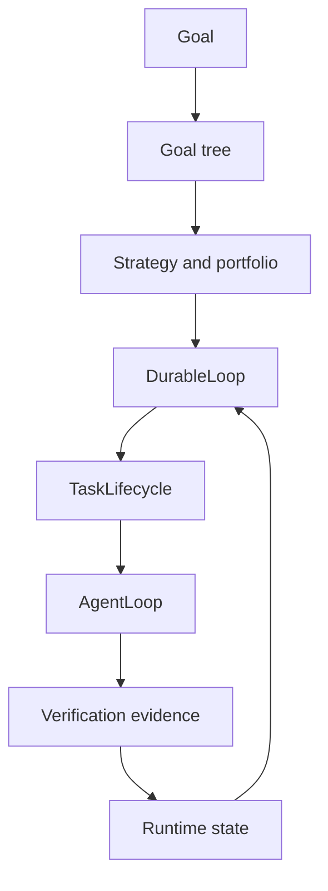
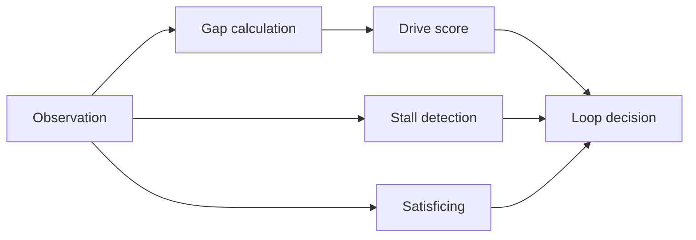

# Goal Orchestration

> Status: Active design contract for PulSeed's long-running goal engine. Goal
> orchestration is current implementation, but it is one capability inside the
> broader personal-agent friend runtime.
> Doc status: active_design_contract
> Grounding use: design_context

Primary map: [Planning Workflow](./planning-workflow-map.md).

PulSeed began as a long-running goal agent. That engine remains the strongest
current wedge: it can hold a goal, decompose work, schedule loops, use bounded
agents, verify progress, wait, recover, and report.

The product balance has changed. Goal orchestration is now the engine the
personal agentic friend uses when a situation calls for sustained work.

## Implementation Anchors

- `src/orchestrator/loop/durable-loop.ts`
- `src/orchestrator/loop/durable-loop/`
- `src/orchestrator/goal/`
- `src/orchestrator/strategy/`
- `src/orchestrator/execution/task/`
- `src/orchestrator/execution/agent-loop/`
- `src/platform/drive/`

## DurableLoop

DurableLoop is the long-running controller. It owns durable decisions such as:

- continue
- wait
- verify
- refine
- decompose
- delegate
- stop
- complete
- recover

It should not become an unbounded agent prompt. Bounded execution belongs to
AgentLoop and ToolExecutor; durable control belongs to DurableLoop.

## Goal Tree

Goals can become trees with parent/child relationships, state aggregation,
dependency ordering, and pruning.

Tree orchestration answers:

- what does this broad goal mean operationally?
- which child goal or task is ready?
- which dependency blocks progress?
- what stale child state should not affect the parent?
- when is the parent satisfied enough?

## Strategy And Portfolio

Strategy management runs multiple hypotheses and actions as a portfolio rather
than a single linear checklist.

Portfolio logic helps PulSeed:

- allocate attention across goals
- rebalance when momentum changes
- stop investing in low-yield paths
- wait for expected effects before measuring
- preserve evidence for later strategy reuse

## Drive, Gap, And Satisficing

The drive system answers why a goal should receive attention.

Gap calculation measures distance from target state. Satisficing decides when a
state is good enough to move forward. Stall detection identifies repeated,
unproductive movement or missing progress signals.

## Waiting

Waiting is a first-class action. It can be correct to wait for:

- elapsed time
- external data
- user approval
- schedule tick
- notification response
- auth handoff
- effect latency
- resource availability

The runtime should preserve wait state rather than treating silence as failure.

## Verification

Execution and verification are separate. Verification sources include:

- direct tool evidence
- command and test output
- task verifier results
- runtime evidence ledgers
- model-assisted checks when allowed
- replay and golden-trace checks

The goal loop should prefer concrete evidence over optimism.

## Companion Boundary

A long-running goal agent can ask "what work moves the goal?" A personal
agentic friend must also ask:

- is this the right time to speak?
- is this target still current?
- does the user need a low-pressure suggestion or a concrete action?
- is permission required?
- should this become a background preparation instead of a notification?

That is why goal docs now sit under execution, not at the center of the design
corpus.
