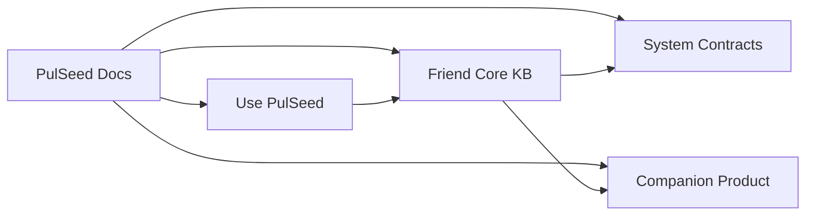

# PulSeed Documentation

This is the root map for PulSeed public documentation. It keeps current
operation first, then points to the Friend Core KB and the lower-level system
contracts that ground it.

## Entry Maps

- [Use PulSeed](./use-pulseed-map.md)
- [Friend Core KB](./core-map.md)
- [System Contracts](./system-contracts-map.md)
- [Companion Product](./companion-product-map.md)

## Reading Rule

Use current operating docs when you need behavior that exists in the current
package. Use Friend Core when you need the companion-product center of gravity.
Use system and companion maps when you need implementation rationale or contract
boundaries. Use product-direction maps for intended product framing.

If code and docs disagree, treat the current code, CLI registry, package
scripts, runtime schemas, and tests as implementation truth. Fix the docs or move
the uncertain claim to product-direction or design-contract material.

## Naming Rules

Use these names consistently:

- PulSeed for the product and repository.
- pulseed for the CLI and npm package.
- pulseed.dev for the website.
- SeedPulse only for legacy references or explicitly historical context.
- DurableLoop for the long-running runtime loop.
