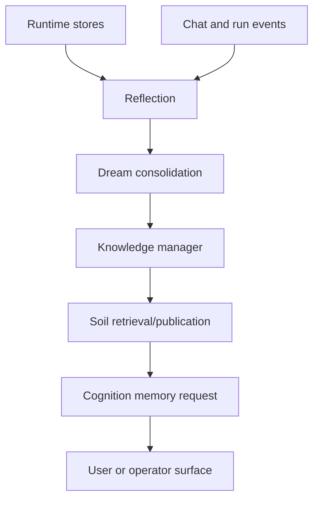
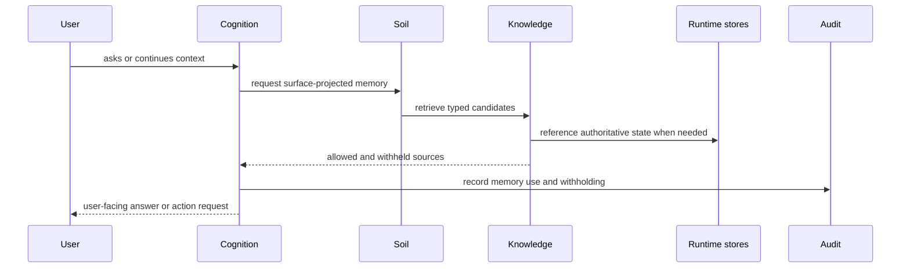

# Soil, Dream, And Learning

> Status: Active design contract for PulSeed's memory, retrieval, dream,
> reflection, correction, and learning surfaces.
> Doc status: active_design_contract
> Grounding use: design_context

Primary map: [Learning And Transfer](./learning-transfer-map.md).

Memory is the path from long-running orchestration to durable personal context.

PulSeed's memory system is intentionally layered. Runtime stores own current
state. Soil exposes readable retrieval and publication surfaces. Dream and
reflection convert verified experience into reusable context. Relationship
memory adds personal facts with governance and correction.

## Implementation Anchors

- `src/platform/soil/`
- `src/platform/dream/`
- `src/reflection/`
- `src/platform/knowledge/`
- `src/platform/corrections/`
- `src/platform/profile/`
- `src/tools/query/SoilQueryTool/`
- `src/tools/execution/SoilOpenTool/`
- `src/tools/execution/SoilPublishTool/`
- `src/tools/execution/SoilRebuildTool/`

## Runtime Store Boundary

Runtime stores remain authoritative for writes; Soil is a typed retrieval and
publication surface.

That means Soil can make memory readable and queryable, but it should not become
an alternate write authority for current runtime state.

## Soil

Soil provides:

- typed content projections
- frontmatter and checksums
- compiled memory projections
- SQLite repository search
- retrieval
- health checks
- local open/view paths
- publish snapshots
- runtime rebuild support

Soil is useful because long-lived agents need readable memory surfaces, not just
opaque internal event logs.

## Dream

Dream consolidates successful or important experience into playbooks, procedural
memory candidates, schedule suggestions, and Soil mutations.

Dream artifacts are inspectable planning hints and learned context. They are not
silent authority to overwrite skills, execute tools, or bypass approvals.

## Reflection

Reflection surfaces include:

- morning planning
- evening catchup
- weekly review
- dream consolidation
- cognition writeback queue
- reflection report state

Reflection is how PulSeed turns experience into reviewable summaries and memory
writeback candidates.

## Knowledge Manager

Knowledge components include:

- knowledge graph
- vector index
- query/search
- transfer state
- revalidation
- linting
- drive score adapter
- agent memory integration

The knowledge system should prefer verified, source-linked reuse over vague
memory accumulation.

## Corrections And Governance

Correction systems include:

- memory correction ledger
- memory governance
- memory quarantine
- user memory operations
- cognition memory review

The correction path is central to trust. A friend-like agent must be able to
forget, suppress, correct, revoke, and quarantine memory in a durable way.

## Memory Flow

## Design Risks

Material memory risks:

- using stale personal facts as current
- treating hidden prompt history as user-facing memory
- failing to preserve correction state
- allowing Dream artifacts to become authority
- mixing runtime-state writes with publication snapshots
- exposing sensitive memory provenance on normal surfaces

The design goal is not "remember everything." It is "remember what is useful,
permitted, correctable, and safe to surface."
