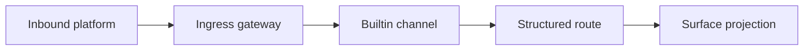

# Gateway Channels

> Status: Current operator reference. This page names the channel boundary; the
> CLI reference owns exact command shapes.
> Doc status: current_operating
> Grounding use: current_truth

PulSeed's builtin gateway channel names are owned by
`src/runtime/gateway/builtin-channel-names.ts`. The setup wizard exposes the
same channel set through `src/interface/cli/commands/setup/steps-gateway.ts`.

## Builtin Channel Boundary

- Telegram and Discord are interactive chat-style ingress channels.
- Slack and email are notification or operator-integration channels unless the
  local configuration explicitly wires them into a conversational route.
- A configured channel still needs a reply target, actor metadata, runtime
  control policy, and projection sink before it should be treated as a normal
  user conversation.

## Related Commands

Use the gateway, Telegram, notify, daemon, and status command sections in the
[CLI Reference](../cli-commands/cli.md). This page should not duplicate their
exact syntax.

## Verification Anchors

- `src/runtime/gateway/builtin-channel-names.ts`
- `src/runtime/gateway/builtin-channel-integrations.ts`
- `src/interface/cli/commands/setup/steps-gateway.ts`
- `src/runtime/gateway/ingress-gateway.ts`
