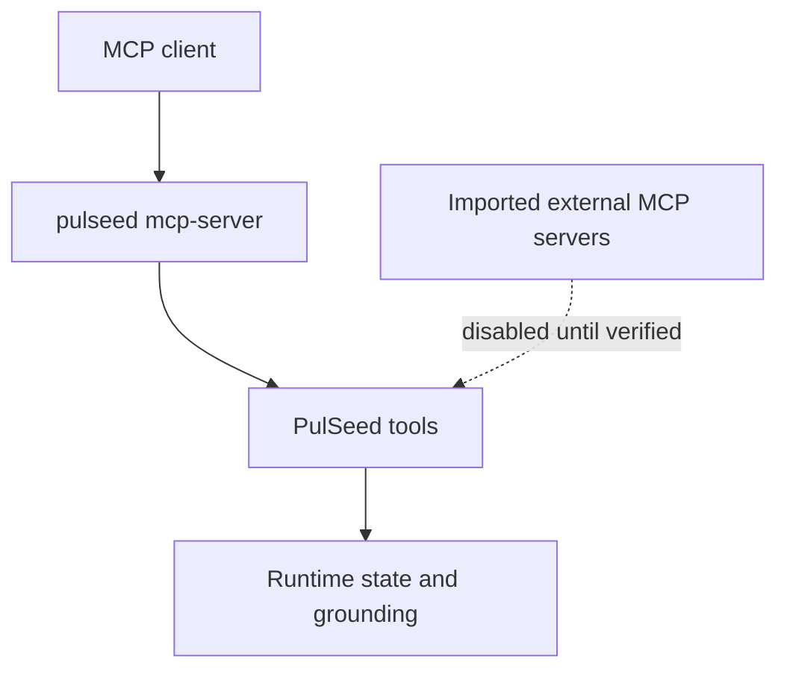

# MCP

> Status: Current operator reference. This page distinguishes PulSeed's MCP
> server from imported external MCP servers.
> Doc status: current_operating
> Grounding use: current_truth

`pulseed mcp-server` starts PulSeed's local MCP server and exposes PulSeed-owned
tools. It is an operator integration surface, not the normal chat/TUI surface.

External MCP server imports are a separate boundary. They should stay disabled
until the tool identity, permission level, environment, and runtime-control
behavior have been verified.

## Related Commands

Use the [CLI Reference](../cli-commands/cli.md) for the exact `mcp-server`,
tool, plugin, and runtime command shapes.

## Verification Anchors

- `src/interface/mcp-server/index.ts`
- `src/interface/mcp-server/tools.ts`
- `src/tools/executor.ts`
- `src/tools/permission.ts`
