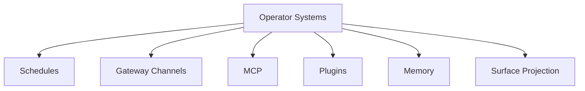

# Operator Systems Map

This map groups operator-facing systems that are current enough to reference
from runbooks.

## Reference

- [Schedules](./schedules.md)
- [Gateway Channels](./gateway-channels.md)
- [MCP](./mcp.md)
- [Plugins](./plugins.md)
- [Memory](./memory.md)
- [Surface Projection Protocol](./surface-projection-protocol.md)
