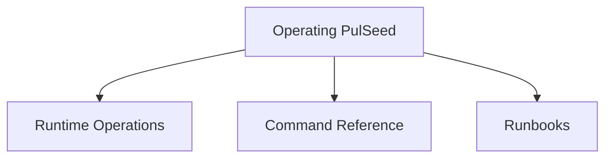

# Operating PulSeed Map

This map is for behavior that exists in the current package: commands, runtime
surfaces, state, configuration, schedules, and diagnostics.

## Child Maps

- [Runtime Operations](./runtime-operations/runtime-operations-map.md)
- [Command Reference](./command-reference/command-reference-map.md)
- [Runbooks](./runbooks/runbooks-map.md)

## Related Context

Getting Started covers installation and first-run setup; reach it from the root
Use PulSeed map.
