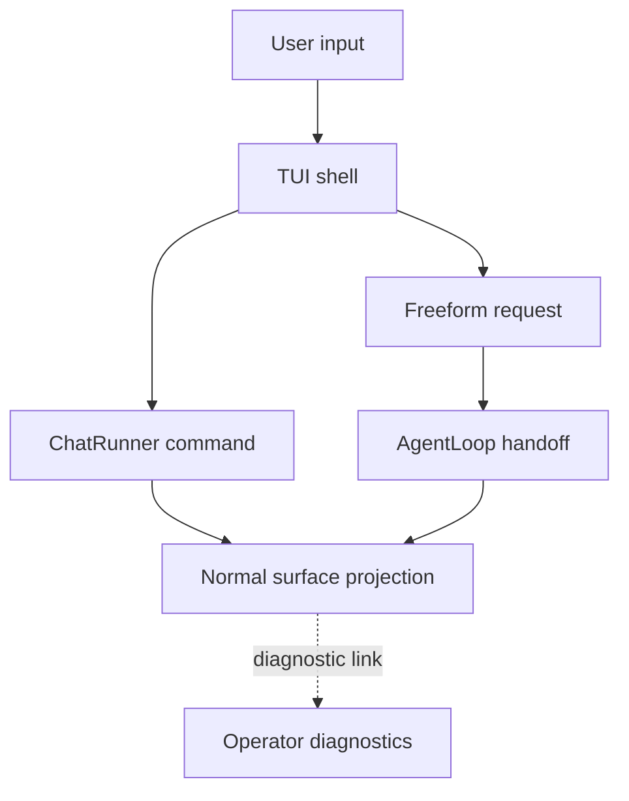

# Chat And TUI Operations

> Status: Current operating runbook. Use this when the user-facing surface is
> chat or the local TUI.
> Doc status: current_operating
> Grounding use: current_truth

Primary references:
[CLI Reference](../command-reference/cli-commands/cli.md),
[Status](../runtime-operations/status.md), and
[Surface Projection Protocol](../command-reference/operator-systems/surface-projection-protocol.md).

## Current Operating Anchors

Bare `pulseed` and `pulseed tui` open the local TUI. Slash commands are split
between TUI-local actions and ChatRunner-owned actions:

- ChatRunner owns saved-session, status, goal/task, configuration, permission,
  usage, review, fork, and undo commands.
- The TUI shell owns visible local actions such as starting or stopping a
  selected loop, toggling dashboard or settings views, and clearing visible
  messages.
- `/clear` is intentionally surface-specific: the TUI clears visible messages,
  while chat-mode command routing can clear persisted conversation history.
- Freeform requests are not classified by command keyword tables. The TUI
  builds a structured ingress and lets the runtime routing path preserve the
  user request.

## Normal Surface Rule

The chat/TUI surface should show user-facing progress, approvals, status, and
results. It should not dump raw RuntimeGraph, capability catalog, policy,
admission, credential, or evidence internals. Use runtime diagnostics only when
the operator is investigating a failure or validating a contract.

## Workflow

1. Start from chat or TUI status, not from raw stores.
2. If a user-visible answer is unclear, check the command reference for the
   exact status, report, usage, or runtime command shape.
3. If the issue is a projection leak or missing explanation, compare the output
   against the Surface Projection Protocol before changing runtime internals.
4. If autonomous work is involved, inspect the active goal/run only after the
   normal status surface has been checked.

## Verification Anchors

- `src/interface/chat/chat-runner.ts`
- `src/interface/chat/chat-command-args.ts`
- `src/interface/tui/app.tsx`
- `src/interface/tui/chat/suggestions.ts`
- `tests/contracts/product-completion-gauntlet.test.ts`
