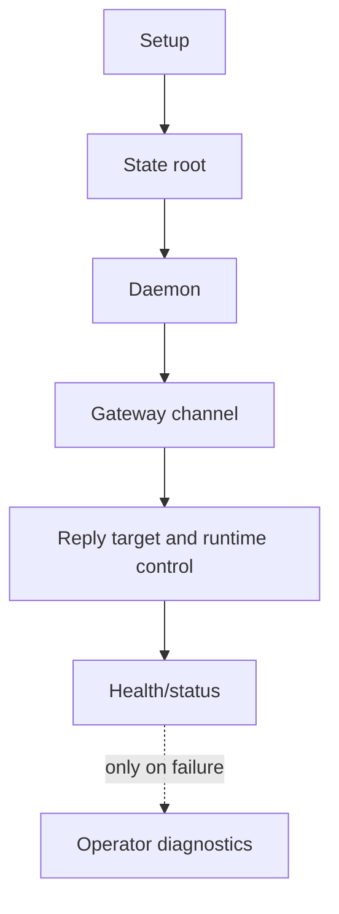

# Daemon And Gateway Readiness

> Status: Current operating runbook. Use this before relying on background or
> inbound gateway behavior.
> Doc status: current_operating
> Grounding use: current_truth

Primary references:
[CLI Reference](../command-reference/cli-commands/cli.md),
[Gateway Channels](../command-reference/operator-systems/gateway-channels.md),
and [MCP](../command-reference/operator-systems/mcp.md).

## Readiness Model

Daemon readiness and gateway readiness are related but different checks. The
daemon answers whether PulSeed has a resident runtime process. The gateway
answers whether an inbound channel can become a structured ingress with the
right actor, reply target, runtime-control boundary, and projection sink.

## Workflow

1. Confirm the state root and provider setup before testing channels.
2. Confirm daemon health with the daemon command surface.
3. Configure the target channel through the gateway or channel-specific setup
   command.
4. Send a harmless test message before relying on background delivery.
5. If the reply target or runtime-control boundary looks wrong, inspect gateway
   diagnostics instead of changing chat prompts.

## Boundaries

- Gateway setup is not proof that every external channel is production-ready.
- MCP server startup exposes PulSeed tools to MCP clients; imported external MCP
  servers remain disabled until explicitly verified.
- Runtime-control allowlists are operating boundaries. They should not be
  bypassed with prompt text.

## Verification Anchors

- `src/runtime/gateway/builtin-channel-names.ts`
- `src/runtime/gateway/builtin-channel-integrations.ts`
- `src/interface/cli/commands/setup/steps-gateway.ts`
- `src/runtime/daemon/runner.ts`
- `src/interface/mcp-server/index.ts`
