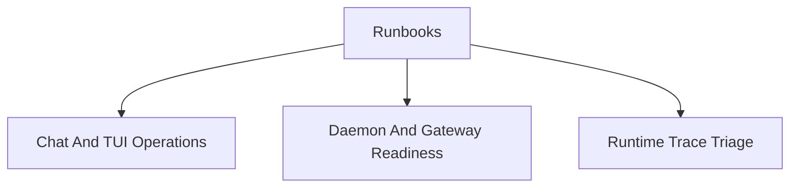

# Runbooks Map

This map groups current operator workflows. Exact commands remain in the command
reference; runbooks explain the order of checks and the handoff between user
surface, daemon, gateway, and diagnostics.

## Runbooks

- [Chat And TUI Operations](./chat-tui-operations.md)
- [Daemon And Gateway Readiness](./daemon-gateway-readiness.md)
- [Runtime Trace Triage](./runtime-trace-triage.md)
