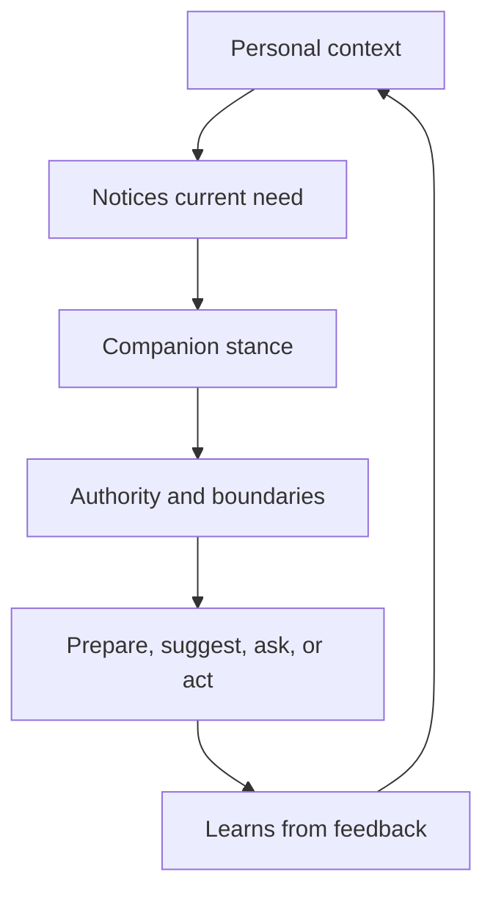
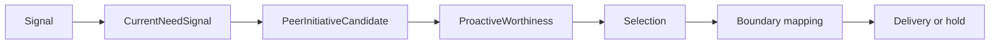
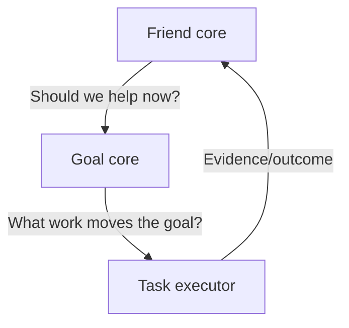

# Agentic Friend Contract

> Status: Current product-design contract grounded in runtime schemas and
> implementation paths. This page describes intended behavior and current
> architecture boundaries, not a complete feature checklist.

Primary map: [Product Framing](./product-framing-map.md).

PulSeed should feel like a personal agentic friend. In this repo, that does not
mean pretending to be human. It means the system has durable context, bounded
initiative, useful silence, continuity, and a clear permission model.

## Friend-Like Means

| Quality | Runtime interpretation |
| --- | --- |
| Knows me | Uses relationship and memory surfaces with allowed-use rules. |
| Notices gently | Converts signals into attention candidates, then inhibits weak or costly ones. |
| Speaks for a reason | Requires grounding, worthiness, and delivery constraints for initiative. |
| Does not nag | Uses cooldowns, reply-optional messages, digest/suggest/notify distinctions. |
| Can help practically | Routes to goals, tasks, tools, schedules, plugins, or drafts. |
| Respects boundaries | Separates inspect, prepare, speak, write, delegate, and external action authority. |
| Can be corrected | Records feedback, correction, suppression, revocation, and memory lifecycle state. |

## Implementation Anchors

The friend contract is represented across several implementation areas:

- `src/runtime/peer-initiative/`
- `src/runtime/attention/`
- `src/runtime/cognition/`
- `src/runtime/personal-agent/`
- `src/runtime/control/`
- `src/runtime/types/companion-autonomy.ts`
- `src/runtime/types/companion-state.ts`
- `src/platform/profile/`
- `src/runtime/store/feedback-ingestion-store.ts`

## Stance

The current peer-initiative contract names allowed and forbidden posture:

- allowed posture: `on_your_side`, `steady`, `lightly_challenging`,
  `carefully_helpful`, `low_pressure`
- durable commitments: support flourishing, notice attention state, prepare
  small next steps, reduce cognitive load, and push back when the user is
  self-undermining
- forbidden posture: servile tool, engagement optimizer, product tutorial bot,
  authority figure, or sole support

That stance is a product constraint, not decorative copy.

## Initiative Boundary

PulSeed can initiate only when the reason is grounded and the cost is low enough.

Initiative candidates include:

- grounding refs
- current need refs
- relationship projection refs
- open thread refs
- capability fit
- draft message
- reply-required set to false
- action plan
- confidence
- maximum delivery kind
- explicit no external-action authority by default

The point is not "PulSeed can randomly speak first." The point is: PulSeed can
have a typed reason to offer care, preparation, a suggestion, a draft, or a
permission request.

## Action Modes

The peer-initiative action plan has four shapes:

| Mode | Product role | Boundary |
| --- | --- | --- |
| `care_only` | Say something useful without requiring a reply | no external action |
| `internal_preparation` | Prepare a plan, summary, option set, reminder candidate, or draft | no external action |
| `permissioned_external_action` | Ask before sending, scheduling, committing, or sharing | explicit confirmation |
| `contextual_capability_disclosure` | Mention a capability only because it fits current need | no tutorial copy |

This is the friend-like difference: capability disclosure happens in context,
not as a product walkthrough.

## Core Balance

DurableLoop can decide what task to run next. The friend core decides
whether the task, message, or preparation is appropriate for the user's current
situation.

This means "core" docs should prioritize companion decision semantics before
goal mechanics.

## Anti-Patterns

Avoid these product behaviors:

- surfacing every internal capability because it exists
- treating a stale previous target as current
- using keyword rules to classify freeform intent
- asking for a reply when the message should stand alone
- creating urgency to justify proactivity
- exposing policy internals in normal chat
- using relationship memory outside its allowed uses
- letting a configured integration imply permission to act

## Success Criteria

PulSeed feels like a friend when:

- the user can ignore low-pressure messages without penalty
- suggestions are specific to the current situation
- pushback is rare, grounded, and useful
- memory is accurate enough to be trusted and correctable enough to recover
- external effects require clear authority
- operator/debug inspection can explain what happened after the fact
