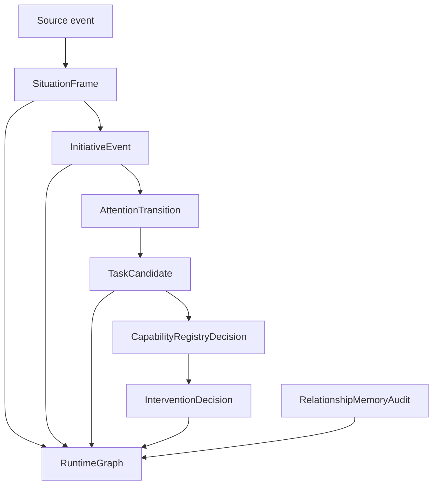

# Personal-Agent Runtime

> Status: Active runtime design contract. This page describes the durable
> personal-agent decision trace and RuntimeGraph model used by current code.

Primary map: [Runtime Governance](./runtime-governance-map.md).

The personal-agent runtime is the durable explanation layer for PulSeed's
friend-like behavior. It records how a situation became a candidate action, how
capability and policy were evaluated, and why the final decision was allow,
hold, block, suppress, or confirm-required.

## Implementation Anchors

- `src/runtime/personal-agent/contracts.ts`
- `src/runtime/personal-agent/trace-builder.ts`
- `src/runtime/personal-agent/store.ts`
- `src/runtime/store/control-db/schema.ts`
- `tests/contracts/personal-agent-runtime.test.ts`
- `tests/contracts/product-completion-gauntlet.test.ts`

## Caller Paths

The runtime trace covers:

- chat gateway turn
- TUI turn
- scheduled wake
- resident proactive
- goal-gap task generation
- runtime control
- notification interruption
- memory correction
- reflection
- task execution
- crash restart resume
- explicit user command
- external signal

This matters because PulSeed is not one loop anymore. It is a set of entry
points that must all preserve the same personal-agent semantics.

## SituationFrame

SituationFrame captures:

- caller path
- source kind and source ref
- replay key
- summary
- cognition situation
- current refs
- memory refs
- withheld memory refs
- stale refs
- uncertainty refs
- conflict refs
- policy refs
- normal-surface trace visibility set to false

The replay key makes the trace deterministic enough for retries and diagnostic
inspection.

## InitiativeEvent

InitiativeEvent records ordered events in a trace:

- signal received
- scheduler wake
- resident observation
- user follow-up
- task candidate proposed
- policy decision recorded
- action requested
- action outcome
- reflection recorded
- memory updated
- runtime resumed

The event sequence is the narrative of the decision.

## TaskCandidate

A TaskCandidate is the proposed effect, not a completed task.

Target kinds include:

- goal
- task
- run
- tool call
- notification
- runtime control
- memory update
- reflection
- attention-only

Desired effects include creating goals, tasks, runs, executing tools, sending
notifications, mutating runtime control, writing memory, recording reflection,
holding concern, continuing route, or doing nothing.

## Capability Decision

Capability decisions are separate from intervention decisions:

- available
- missing
- permission required
- blocked
- not applicable

This avoids a common architecture bug: treating "we have a plugin" as "we may
use the plugin now." Capability availability is not authority.

## Intervention Decision

Intervention decisions are:

- allow
- hold
- block
- suppress
- confirm required

They record target effect, permission requirement, policy ref, reason, audit
refs, and normal-surface trace visibility.

## RuntimeGraph

RuntimeGraph turns trace entities into queryable nodes and edges. Node kinds
include goals, sessions, runs, tasks, process sessions, commitments,
milestones, artifacts, reply targets, situation frames, initiative events, task
candidates, intervention decisions, capability decisions, and memory records.

Edge kinds include:

- derived from
- decided by
- requires capability
- targets
- parent of
- replies to
- produced
- invalidates
- supersedes
- resumes

RuntimeGraph nodes with `runtime_graph_role=source_of_truth` are the durable
authority for runtime entities. Projection reads can exist for compatibility,
but they must not become an alternate truth path.

## Relationship Memory Audit

Relationship-memory audits preserve:

- allowed and forbidden uses
- uncertainty
- lifecycle and correction state
- surface projection
- conflicts
- provenance

This is how PulSeed can explain why a memory was used, withheld, corrected, or
invalidated.

## Normal Surface Boundary

The runtime trace is normally hidden from user-facing chat. It exists so the
system can be inspected and debugged without turning normal interaction into a
trace dump.

Normal surface:

- concise explanation
- next safe action
- permission request when needed

Operator/debug surface:

- trace IDs
- graph nodes
- policy refs
- memory provenance
- capability decisions
- intervention outcomes
